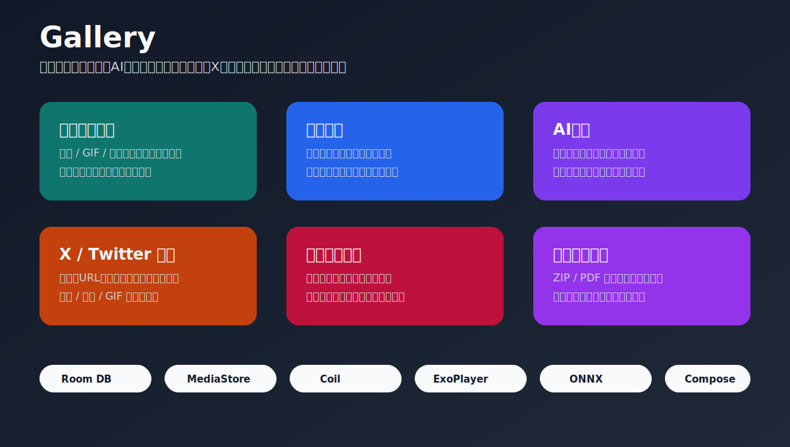

# Gallery

Gallery は、端末内の画像・GIF・動画・ZIP/PDF 漫画・X / Twitter 由来メディアを、閲覧、分類、AI 分析、整理、制作補助までまとめて扱う Android ギャラリーアプリです。



## できること

| 機能 | 概要 | 詳細設計 |
| --- | --- | --- |
| メディア一覧 | MediaStore の画像、GIF、動画を高速グリッド表示。日/月/年/ストレージ単位の俯瞰、1/3/4/7/28 列表示、フィルタ、ソートに対応。 | [メディア一覧・検索/フィルタ](docs/detail_design/01_media_gallery.md) |
| メディアビューア | 画像、GIF、動画を全画面表示。ズーム、スワイプ、動画再生、フレーム保存、壁紙設定、タグ編集、削除に対応。 | [メディアビューア](docs/detail_design/02_media_viewer.md) |
| My List・AI 分析 | お気に入り、未整理、AI 未分析、タグカテゴリを表示。ONNX タグ推論、年齢制限判定、MediaPipe ベクトル生成を実行。 | [My List・AI分析](docs/detail_design/03_mylist_ai.md) |
| フォルダ・ゴミ箱・一括編集 | フォルダ管理、フォルダ移動、フォルダサムネイル、一括タグ/年齢制限編集、アプリ内ゴミ箱、復元、完全削除。 | [フォルダ管理・ゴミ箱・一括編集](docs/detail_design/04_folder_trash_bulk.md) |
| X / Twitter ダウンロード | 共有 URL、VIEW URL、クリップボード、手入力、直接 URL から動画・画像・GIF を保存。履歴と重複判定つき。 | [X / Twitter ダウンロード](docs/detail_design/05_x_downloader.md) |
| 漫画ビューア | ZIP / PDF 漫画をスキャンし、単ページ/見開き、右開き/左開き、しおり、スクショ保存に対応。 | [漫画ビューア](docs/detail_design/06_book_viewer.md) |
| お絵描き資料 | イラスト制作中の参考画像をプロジェクト単位で一時収集。WebView 検索、画像長押し追加、検索画面スクショ保存、完了時整理に対応。 | [お絵描き資料参照プロジェクト](docs/detail_design/07_reference_projects.md) |
| おすすめ・視聴履歴 | 閲覧回数、閲覧時間、タグ類似、画像ベクトル類似、ランダム候補からおすすめを表示。 | [おすすめ・視聴履歴](docs/detail_design/08_recommendations_history.md) |
| お気に入り作家・サイト | 作家リンク、サイトリンク、カスタムサイト、Google 検索補助、JSON バックアップを管理。 | [お気に入り作家・サイト](docs/detail_design/09_favorite_creators_sites.md) |
| 共通基盤 | GalleryState、Room、Coil、起動時サムネイル生成、AI モデル取得、グローバル進捗を管理。 | [共通基盤・起動タスク](docs/detail_design/10_shared_services.md) |

## 設計ドキュメント

基本設計書には全体ユースケース、全体利用フロー、ER 図、主要シーケンス、API・外部連携、保存先、制約をまとめています。各詳細設計には機能別の画面説明、UIモック、ユースケース図、操作フロー、関連 DB、DAO/Repository、シーケンス、利用 API を記載しています。

- [更新履歴 / CHANGELOG](app/src/main/assets/CHANGELOG.md)
- [基本設計書](基本設計書.md)
- [メディア一覧・検索/フィルタ 詳細設計](docs/detail_design/01_media_gallery.md)
- [メディアビューア 詳細設計](docs/detail_design/02_media_viewer.md)
- [My List・AI分析 詳細設計](docs/detail_design/03_mylist_ai.md)
- [フォルダ管理・ゴミ箱・一括編集 詳細設計](docs/detail_design/04_folder_trash_bulk.md)
- [X / Twitter ダウンロード 詳細設計](docs/detail_design/05_x_downloader.md)
- [漫画ビューア 詳細設計](docs/detail_design/06_book_viewer.md)
- [お絵描き資料参照プロジェクト 詳細設計](docs/detail_design/07_reference_projects.md)
- [おすすめ・視聴履歴 詳細設計](docs/detail_design/08_recommendations_history.md)
- [お気に入り作家・サイト 詳細設計](docs/detail_design/09_favorite_creators_sites.md)
- [共通基盤・起動タスク 詳細設計](docs/detail_design/10_shared_services.md)

## 技術スタック

| 分類 | 技術 |
| --- | --- |
| 言語 | Kotlin |
| UI | Jetpack Compose, Material3 |
| 画面遷移 | Navigation Compose |
| 一覧 | LazyVerticalGrid, Paging 3 |
| DB | Room SQLite |
| メディア | Android MediaStore, ContentResolver, Coil, Media3 ExoPlayer |
| AI | ONNX Runtime Android, MediaPipe Tasks Vision |
| 通信 | OkHttp, Conscrypt |
| 非同期 | Kotlin Coroutines, Flow |

## 主なデータ

Room DB は `gallery_database` version `18` です。

| テーブル | 内容 |
| --- | --- |
| `media_metadata` | メディアのメタデータ、AI 状態、削除状態、特徴ベクトル、サムネイル状態 |
| `media_tags` | タグと信頼度 |
| `measure_stats` | 閲覧回数、閲覧時間、最終閲覧日時 |
| `managed_folders` / `folder_order` | 管理フォルダと表示順 |
| `video_downloads` | X / Twitter ダウンロード履歴 |
| `reference_projects` / `reference_items` | お絵描き資料プロジェクトと資料画像 |

## 開発メモ

```powershell
.\gradlew.bat :app:compileDebugKotlin
```

このリポジトリでは、上記の Kotlin コンパイルを基本の確認コマンドとして使います。
