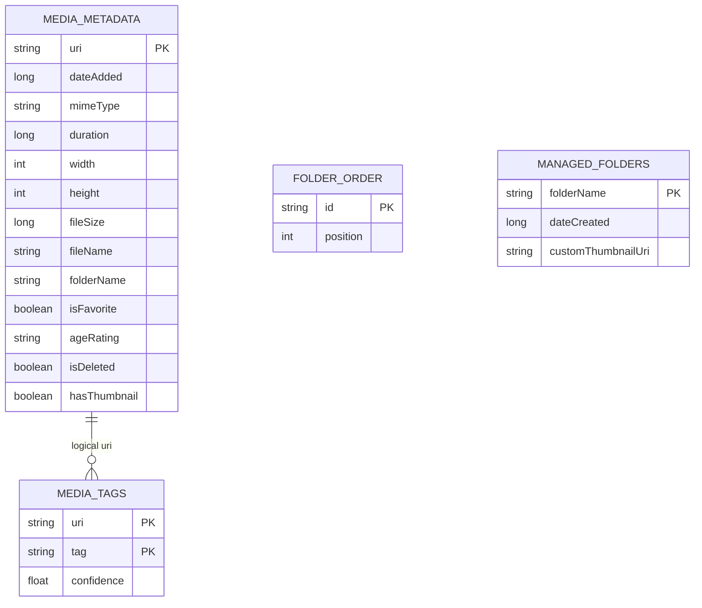
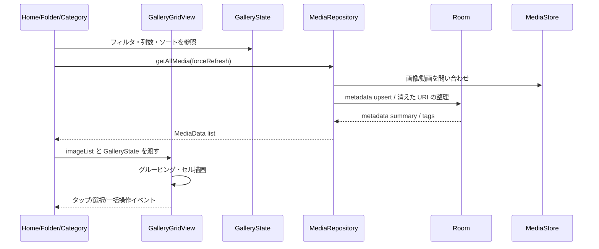

# メディア一覧・検索/フィルタ 詳細設計

## 1. 概要

端末内の画像、GIF、動画を MediaStore から取得し、Room に保存したメタデータと結合して一覧表示する。大量メディアを前提に、通常表示と 28 列の高密度表示で処理負荷を分ける。

## 2. お客さん目線の説明

端末内の写真、GIF、動画をまとめて見られるメイン画面です。日付ごと、月ごと、年ごとに眺めたり、画像だけ、動画だけ、R18 だけのように絞り込めます。列数を増やすと全体をざっと俯瞰でき、28 列では細かい内容よりも「大量の中から位置を探す」ことを優先します。

## 3. エンジニア目線の説明

`MediaRepository` が MediaStore と Room を突き合わせ、`MediaData` と `MediaMetadataSummary` を UI に渡す。`GalleryGridView` は `LazyVerticalGrid` で通常リストと Paging の両方を扱う。フィルタとソートは `GalleryState` の enum と `MediaDao.getFilteredMediaPagingSource()` に集約する。

## 4. 画面設計

| 項目 | 内容 |
| --- | --- |
| 主画面 | `HomeGalleryScreen`, `FolderGalleryScreen`, `CategoryScreen` |
| 一覧部品 | `GalleryGridView` |
| 表示単位 | メディアセル、日/月/年/ストレージヘッダー |
| 操作 | タップでビューア、長押しで選択、ドラッグで範囲選択、一括編集、一括移動 |
| 表示切替 | 列数 1 / 3 / 4 / 7 / 28、グルーピング、メディア種別、年齢制限、端末向け比率、ソート |

## 5. 関連 DB

| テーブル | 用途 |
| --- | --- |
| `media_metadata` | メディアの日時、サイズ、種別、フォルダ、AI 状態、削除状態、サムネイル状態 |
| `media_tags` | タグ別カテゴリ、タグフィルタ |
| `folder_order` | フォルダやグループの表示順 |
| `managed_folders` | 管理対象フォルダ |

## 6. ER 図

## 7. DAO / Repository

| 種別 | 実装 | 役割 |
| --- | --- | --- |
| DAO | `MediaDao.getFilteredMediaPagingSource()` | Room 側のフィルタ・ソート付き PagingSource |
| DAO | `getAllMetadataSummaryFlow()` | UI 表示用の軽量メタデータ Flow |
| DAO | `getAllTagsWithUris()` | タグ分類用データ |
| Repository | `MediaRepository.getAllMedia()` | MediaStore 走査と `MediaData` 変換 |
| Repository | `MediaRepository.getAllMetadataSummary()` | UI 側の metadata map 作成 |
| UI | `GalleryGridView` | グリッド表示、選択、スクロール、密度別描画 |

## 8. シーケンス図

## 9. 補足

- 28 列は性能優先の特別表示。詳細確認は通常列数またはビューアで行う。
- 動画サムネイルは黒画面を避けるため専用のフレーム取得を使う。
- GIF は一覧では静止サムネイル、ビューアでは GIF として扱う。
