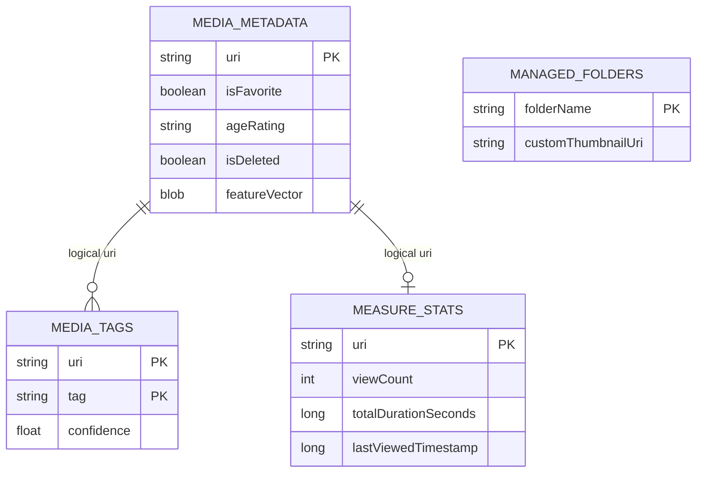
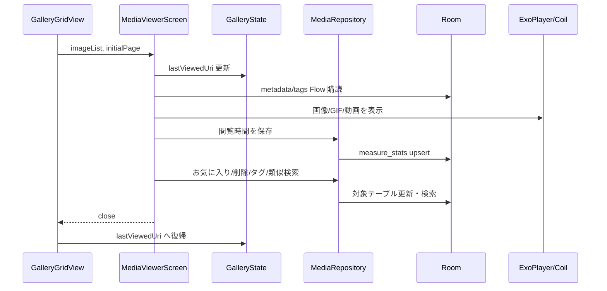

# メディアビューア 詳細設計

## 1. 概要

画像、GIF、動画を同一ビューアで開き、ズーム、スワイプ、タグ編集、削除、壁紙、フレーム保存、関連メディア表示を行う。

## 2. お客さん目線の説明

ギャラリーで選んだメディアを全画面で確認できます。画像は拡大して細部を見られ、動画は再生やシーク、フレーム保存ができます。GIF も再生しながらフレームを取り出せます。お気に入りやタグ変更、削除もこの画面からできます。

## 3. エンジニア目線の説明

`MediaViewerScreen` が `MediaData` リストと開始ページを受け取る。画像/GIF は Coil と補助抽出処理、動画は Media3 ExoPlayer を使う。閲覧位置は `GalleryState.lastViewedUri`、閲覧統計は `MediaRepository.updateMeasureStats()` 経由で `measure_stats` に保存する。

## 4. 画面設計

| 領域 | 内容 |
| --- | --- |
| 表示領域 | `HorizontalPager` による前後メディア移動 |
| ジェスチャ | ピンチズーム、ダブルタップ、パン、左右スワイプ、上/下スワイプ |
| 操作バー | お気に入り、タグ編集、削除、復元、完全削除、壁紙、フレーム保存 |
| 動画操作 | 再生/一時停止、ミュート、シーク、送り/戻し、フレーム送り |
| GIF 操作 | フレーム抽出、表示フレーム保存、表示フレーム壁紙 |
| 関連表示 | タグ類似、ベクトル類似によるおすすめタブ |

## 5. 関連 DB

| テーブル | 用途 |
| --- | --- |
| `media_metadata` | お気に入り、年齢制限、削除状態、特徴ベクトル |
| `media_tags` | タグ表示・編集 |
| `measure_stats` | 閲覧回数、閲覧時間、最終閲覧日時 |
| `managed_folders` | フォルダサムネイル設定 |

## 6. ER 図

## 7. DAO / Repository

| 種別 | 実装 | 役割 |
| --- | --- | --- |
| DAO | `getMetadataSummaryFlow(uri)` | 表示中メディアの軽量状態取得 |
| DAO | `getTagsForMedia(uri)` | タグ一覧取得 |
| DAO | `updateFavorite()` | お気に入り更新 |
| DAO | `setDeleted()` / `bulkSetDeleted()` | ゴミ箱状態更新 |
| DAO | `insertMeasureStats()` | 閲覧統計保存 |
| Repository | `updateMeasureStats()` | 閲覧回数と時間の加算 |
| Repository | `findMediaByTagSimilarity()` | タグ類似候補 |
| Repository | `findSimilarVisualMedia()` | ベクトル類似候補 |

## 8. シーケンス図

## 9. 補足

- ビューアのタップ、ダブルタップ、ピンチ、パン、動画シークは競合しやすいため、ジェスチャの優先順位を崩さない。
- 参照プロジェクトから開く場合は `galleryState=null` で、削除ボタンなど通常ギャラリー操作を隠す。
