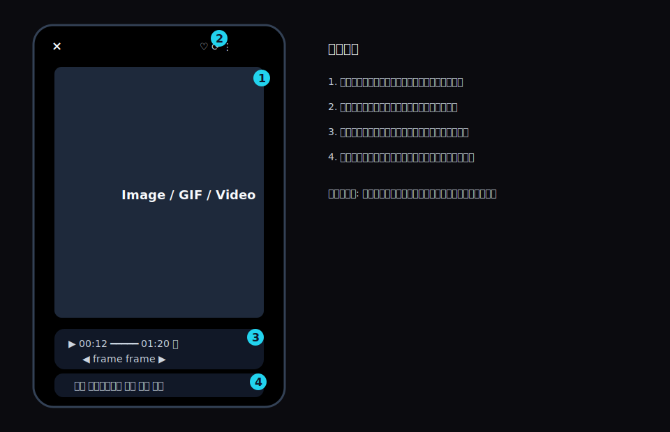
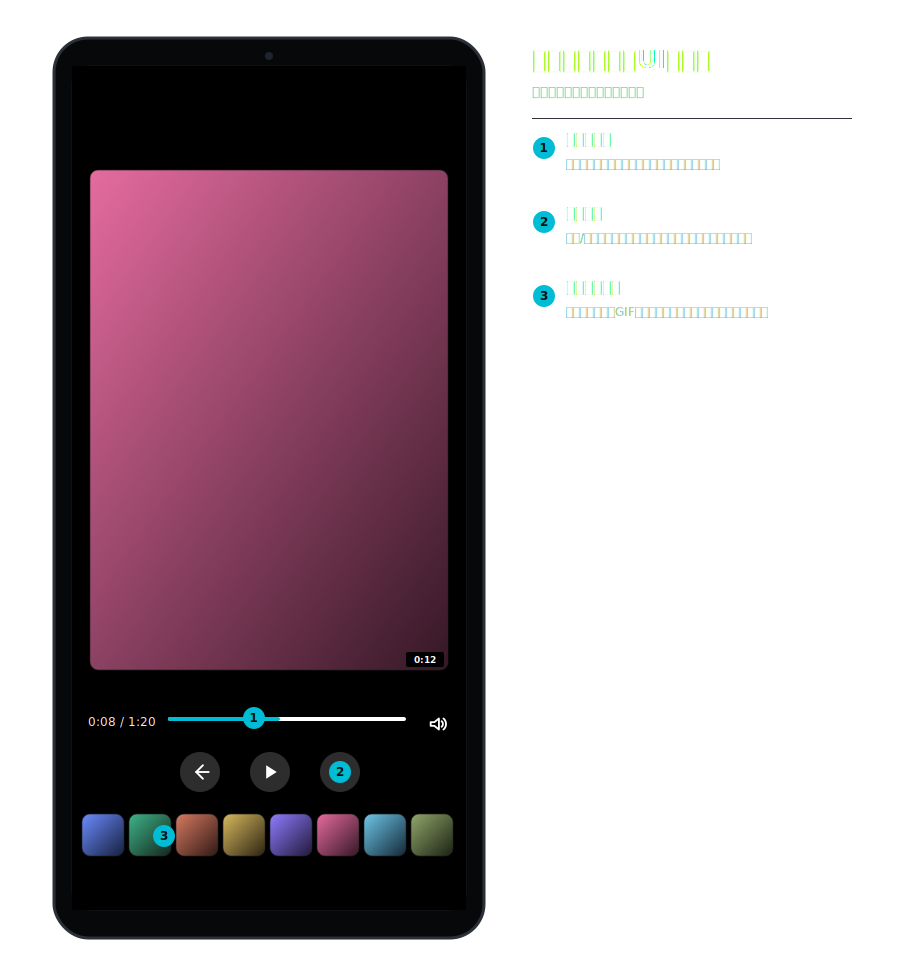
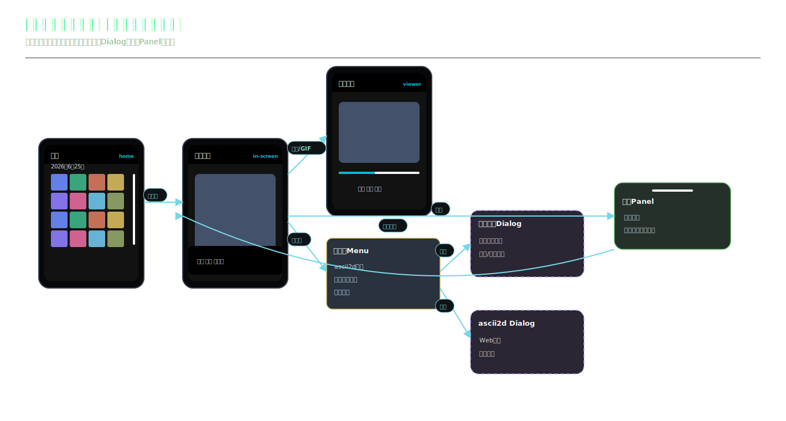
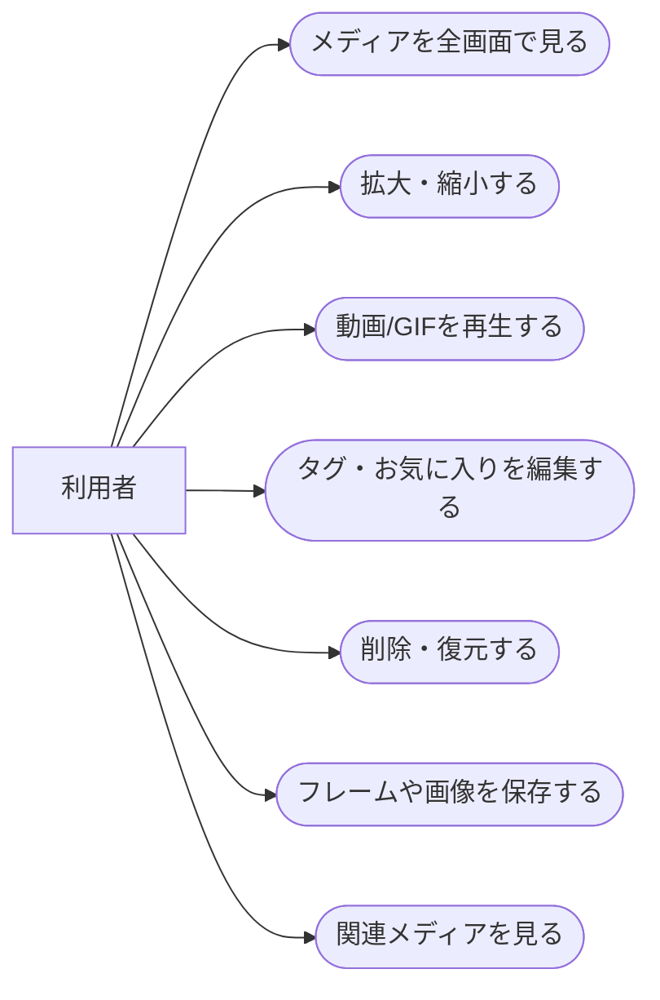
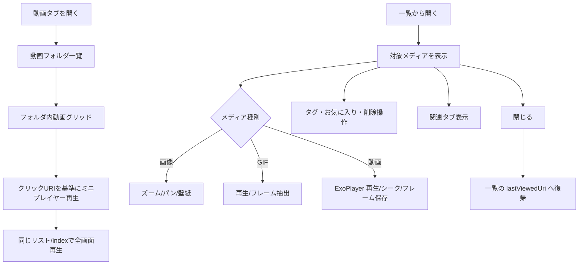
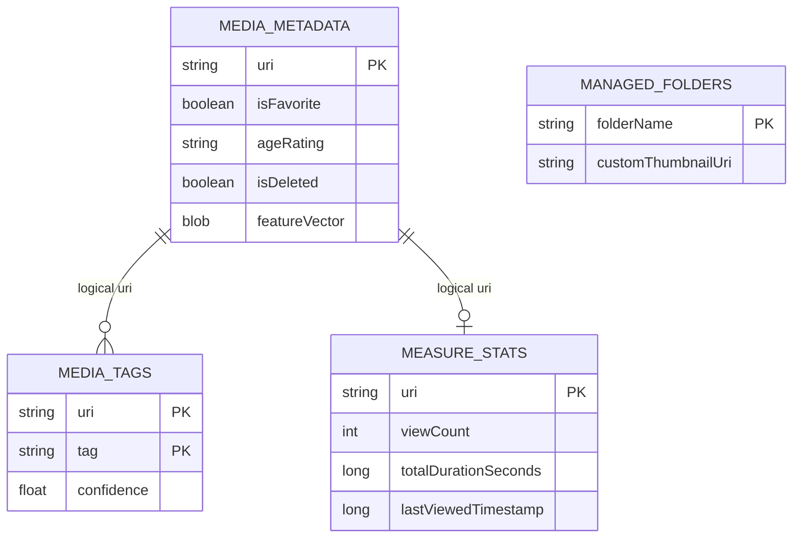
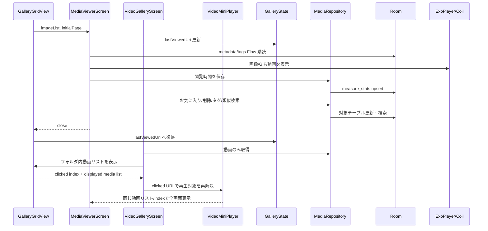

# メディアビューア 詳細設計

## 1. 概要

画像、GIF、動画を同一ビューアで開き、ズーム、スワイプ、タグ編集、削除、壁紙、フレーム保存、関連メディア表示を行う。

## 2. 利用者向け機能説明

ギャラリーで選んだメディアを全画面で確認できます。画像は拡大して細部を見られ、動画は再生やシーク、フレーム保存ができます。GIF も再生しながらフレームを取り出せます。お気に入りやタグ変更、削除もこの画面からできます。

## 3. 開発者向け技術説明

`MediaViewerScreen` が `MediaData` リストと開始ページを受け取る。画像/GIF は Coil と補助抽出処理、動画は Media3 ExoPlayer を使う。閲覧位置は `GalleryState.lastViewedUri`、閲覧統計は `MediaRepository.updateMeasureStats()` 経由で `measure_stats` に保存する。

動画専用入口では `VideoGalleryScreen` が動画のみをフォルダ別に抽出し、フォルダ内グリッドで選択した動画を `VideoMiniPlayer` に渡す。プレビュー再生と全画面再生は、タップ時に `GalleryGridView` から返された実リストと URI を基準に対象を決め、画面表示順と再生対象のずれを防ぐ。

## 4. 画面設計

### 4.1. 画面の説明

メディアビューアは、一覧で選んだメディアを画面いっぱいに表示する確認・操作画面である。ユーザーは左右スワイプで前後のメディアへ移動し、画像はピンチやダブルタップで拡大、動画は再生操作、GIF はアニメーション再生やフレーム確認を行う。

普段はメディアへの没入感を優先し、タップで操作バーや詳細情報を出し入れする。お気に入り、タグ、削除、壁紙、フレーム保存など、対象メディアに対する編集・活用操作はこの画面から実行できる。参照プロジェクトから開いた場合は、資料確認が目的なので通常ギャラリーの削除系操作は抑制する。

### 4.2. 画面要素

| 領域 | 内容 |
| --- | --- |
| 表示領域 | `HorizontalPager` による前後メディア移動 |
| ジェスチャ | ピンチズーム、ダブルタップ、パン、左右スワイプ、上/下スワイプ |
| 操作バー | お気に入り、タグ編集、削除、復元、完全削除、壁紙、フレーム保存 |
| 動画操作 | 再生/一時停止、ミュート、シーク、送り/戻し、フレーム送り |
| 動画専用画面 | フォルダ別動画一覧、ミニプレイヤー、全画面再生への切り替え |
| GIF 操作 | フレーム抽出、表示フレーム保存、表示フレーム壁紙 |
| 関連表示 | タグ類似、ベクトル類似によるおすすめタブ |

### 4.3. UIモック

#### 静止画/GIF/通常ビューア

#### 動画操作パネル

#### 関連メディアパネル

| 番号 | UI部品 | 機能 |
| --- | --- | --- |
| 1 | 通常ビューア | 黒背景の全画面表示、上部操作、下部メニューを重ねて表示する。 |
| 2 | 動画操作パネル | 再生/一時停止、シーク、ミュート、フレーム送り、サムネイル列を表示する。 |
| 3 | 関連メディアパネル | ビューア下部にタグ類似、ベクトル類似、ランダム候補の関連カードを表示する。 |
| 4 | 対象操作 | お気に入り、回転、削除、フォルダ、タグ、壁紙、フレーム保存を現在メディアへ適用する。 |
| 5 | 動画ミニプレイヤー | 動画専用画面でタップした動画を画面内プレビューし、前後移動と全画面表示を行う。 |

#### 動画専用プレビュー/全画面ビュワー

- `VideoMiniPlayer` は動画枠内プレビューとして表示し、右上に閉じる、左上に全画面表示、下端に動画枠と一体化した細いシークバーを重ねる。プレビュー動画が終端に到達した場合は自動的にプレビューを閉じる。
- `VideoFullscreenViewerScreen` は動画専用の全画面ビュワーとして扱い、左右スワイプによる前後動画移動は行わない。下部に再生/停止、前の動画、次の動画を中心配置し、左側にスクリーンショット、右側に画面回転を置く。
- 全画面中の左右スワイプは 1 フレーム単位のコマ送りに使う。ドラッグ中は再生を一時停止し、指を離した時点で元が再生中なら再開する。現在時刻表示はミリ秒まで表示する。
- 右端の上下スワイプは音量、左端の上下スワイプは画面輝度を調整する。調整中は中央に `Volume` / `Brightness` とパーセンテージ、バーを一時表示し、どちらを変更しているかを明確にする。
- 右上の一覧アイコンで同一フォルダ内の前後動画サムネイルを表示する。縦画面では画面上部の横スクロール、横画面では画面右端の縦スクロールとして表示し、選択した動画へ即時切り替える。

### 4.4. 機能内画面遷移図

一覧からビューアへ入り、動画操作、その他メニュー、タグ編集、ascii2d検索、関連メディアパネルへ展開する流れを、画面タイトル付きのミニUIモックと矢印で示す。

### 4.5. ユースケース図

### 4.6. 画面/操作フロー

## 5. 関連 DB

| テーブル | 用途 |
| --- | --- |
| `media_metadata` | お気に入り、年齢制限、削除状態、特徴ベクトル |
| `media_tags` | タグ表示・編集 |
| `measure_stats` | 閲覧回数、閲覧時間、最終閲覧日時 |
| `managed_folders` | フォルダサムネイル設定 |

## 6. ER 図

## 7. DAO / Repository

| 種別 | 実装 | 役割 |
| --- | --- | --- |
| DAO | `getMetadataSummaryFlow(uri)` | 表示中メディアの軽量状態取得 |
| DAO | `getTagsForMedia(uri)` | タグ一覧取得 |
| DAO | `updateFavorite()` | お気に入り更新 |
| DAO | `setDeleted()` / `bulkSetDeleted()` | ゴミ箱状態更新 |
| DAO | `insertMeasureStats()` | 閲覧統計保存 |
| Repository | `updateMeasureStats()` | 閲覧回数と時間の加算 |
| Repository | `findMediaByTagSimilarity()` | タグ類似候補 |
| Repository | `findSimilarVisualMedia()` | ベクトル類似候補 |

## 8. シーケンス図

## 9. 補足

- ビューアのタップ、ダブルタップ、ピンチ、パン、動画シークは競合しやすいため、ジェスチャの優先順位を崩さない。
- 参照プロジェクトから開く場合は `galleryState=null` で、削除ボタンなど通常ギャラリー操作を隠す。
- 動画専用画面ではシステムバー領域をテーマ背景色で塗り、プレビュー再生対象は index だけでなく URI で照合する。

## 10. 利用 API・外部連携

| API / ライブラリ | 用途 |
| --- | --- |
| Coil | 画像・GIF 表示 |
| Media3 ExoPlayer | 動画再生、シーク、フレーム操作 |
| Android `MediaStore` | スクリーンショットやフレーム画像の保存 |
| Android `ContentResolver` | URI 読み取り、ファイル情報取得 |
| Android `WallpaperManager` | 壁紙設定 |
| WebView / ascii2d | 画像検索補助 |
