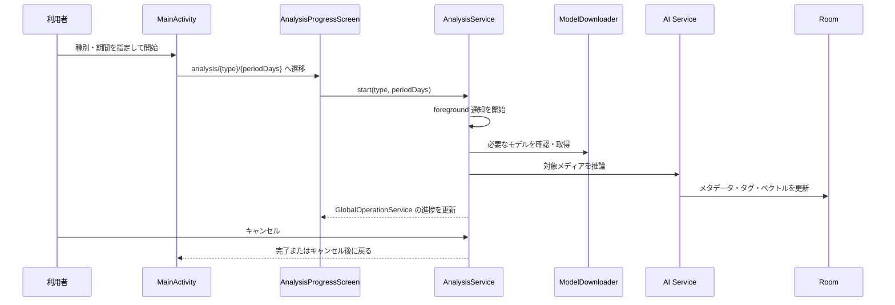

# AI 分析 詳細設計

## 1. 概要

端末内のメディアに対して、AI タグ、年齢区分、画像特徴ベクトルを生成する。結果は `media_metadata` と `media_tags` に保存し、一覧のフィルタ、類似グループ、ビューア内の視覚類似候補に利用する。

## 2. 画面と起動

分析開始の確認・期間指定は `MainActivity` のダイアログで行う。開始後は `analysis/{type}/{periodDays}` の `AnalysisProgressScreen` を表示する。この画面は進捗表示とギャラリーへ戻る導線を持つ。

| 項目 | 実装 |
| --- | --- |
| ルート | `AppRoutes.ANALYSIS_PATTERN` |
| 画面 | `AnalysisProgressScreen` |
| サービス | `AnalysisService`（foreground service） |
| 共通進捗 | `GlobalOperationService` / `GlobalProgressOverlay` |
| AI タグ | `AiTaggingService` + ONNX Runtime |
| 特徴ベクトル | `VectorSearchService` + MediaPipe Tasks Vision |
| モデル取得 | `ModelDownloader` |

## 3. 処理フロー

## 4. データ更新

| データ | 更新内容 |
| --- | --- |
| `media_metadata` | AI 分析済み状態、年齢区分、特徴ベクトル、サムネイル関連状態 |
| `media_tags` | AI 推論タグ、信頼度、手動タグとの共存情報 |
| `tag_translations` | 表示用翻訳と手動上書き |

## 5. 制約・失敗時

- モデル取得にはネットワーク接続が必要。取得または初期化に失敗した場合は分析を完了扱いにせず、進捗とエラーを UI に反映する。
- 実行中は foreground notification を表示する。
- キャンセル要求は `GlobalOperationService` とサービスの両方へ送る。モデルダウンロード中は取得完了後にキャンセル状態を再確認する。
- 熱状態に応じて分析を待機し、定期的に再評価する。
