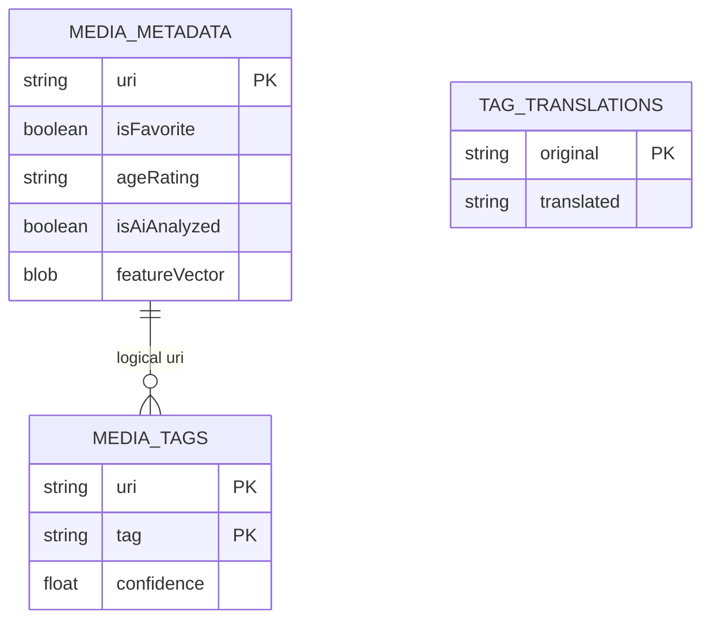
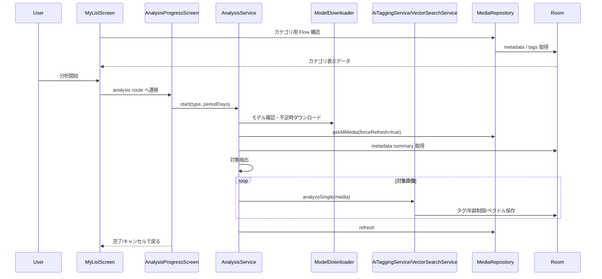

# My List・AI分析 詳細設計

## 1. 概要

お気に入り、未整理、AI 未分析、ベクトル未分析、タグカテゴリを My List として表示し、AI 分析やカテゴリ別閲覧へ接続する。

## 2. お客さん目線の説明

自分が整理したいものだけをまとめて見られる画面です。まだタグがない画像、AI で分析していない画像、お気に入り、タグごとのまとまりをすぐ開けます。AI 分析は期間を選んで実行でき、進捗も確認できます。

## 3. エンジニア目線の説明

`MyListScreen` は `MediaRepository` の Flow と metadata map からカテゴリを組み立てる。分析開始時は Navigation で `analysis/{type}/{periodDays}` へ遷移し、`AnalysisService` が foreground service として対象メディアを順次処理する。

## 4. 画面設計

| 領域 | 内容 |
| --- | --- |
| My List 一覧 | Favorites、Untagged、Unanalyzed AI、Unanalyzed Vector、Tag categories |
| カテゴリ詳細 | `CategoryScreen` で対象メディアをグリッド表示 |
| 分析起動 | 分析種別と対象期間を選択 |
| 分析進捗 | `AnalysisProgressScreen` で進捗、キャンセル、完了後 My List 復帰 |

## 5. 関連 DB

| テーブル | 用途 |
| --- | --- |
| `media_metadata` | `isFavorite`, `isAiAnalyzed`, `ageRating`, `featureVector` |
| `media_tags` | タグカテゴリ、AI タグ結果 |
| `tag_translations` | AI タグの表示名変換 |

## 6. ER 図

## 7. DAO / Repository / Service

| 種別 | 実装 | 役割 |
| --- | --- | --- |
| DAO | `getFavoriteUris()` | お気に入り URI |
| DAO | `getAllTagsWithCounts()` | タグカテゴリ件数 |
| DAO | `saveAiAnalysisResult()` | タグ、年齢制限、分析済み状態の保存 |
| DAO | `updateFeatureVector()` | ベクトル保存 |
| Repository | `getUntaggedMedia()` | 未整理メディア |
| Repository | `getUnanalyzedAiCount()` | AI 未分析数 |
| Service | `AnalysisService` | 分析全体の foreground 実行 |
| Service | `AiTaggingService` | ONNX タグ推論 |
| Service | `VectorSearchService` | MediaPipe ベクトル生成 |

## 8. シーケンス図

## 9. 補足

- 動画は AI タグ・ベクトル分析対象から除外する。
- 端末温度が高い場合は `AnalysisService` がクールダウンまたは一時停止する。
- `AUTO_RATING` は設計上の分析種別として扱われるが、現状コードでは主にタグ分析とベクトル分析が実処理の中心。
