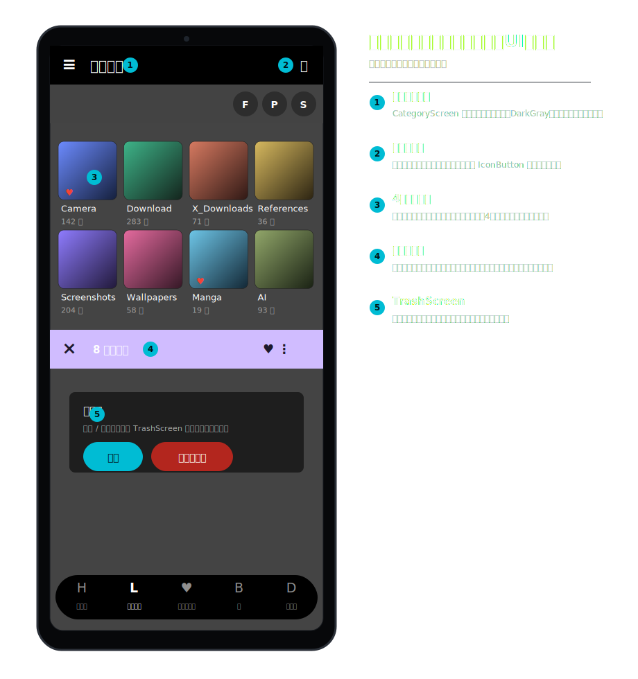
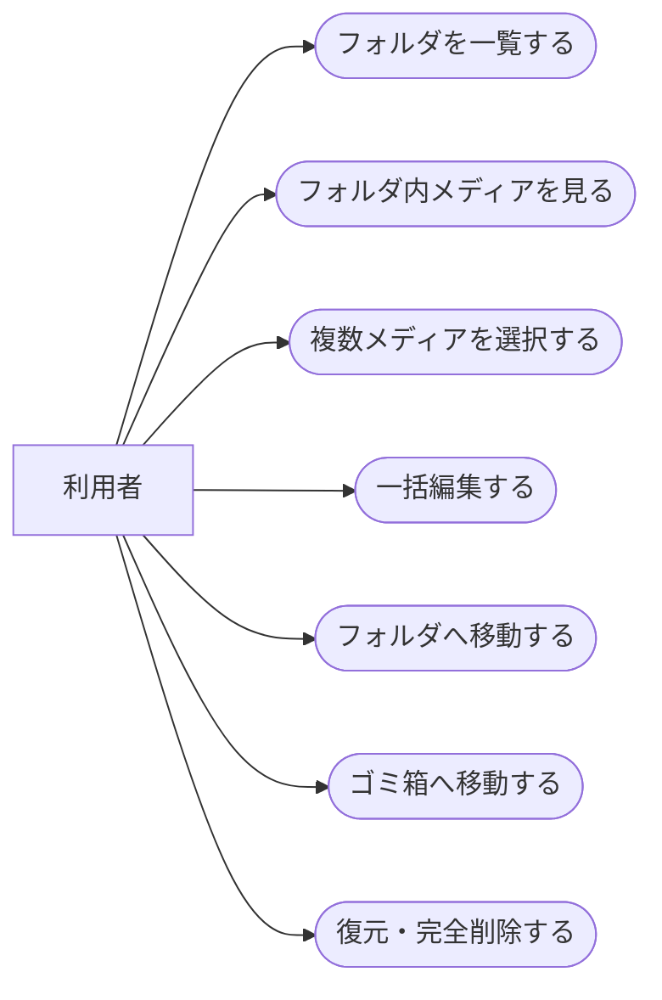
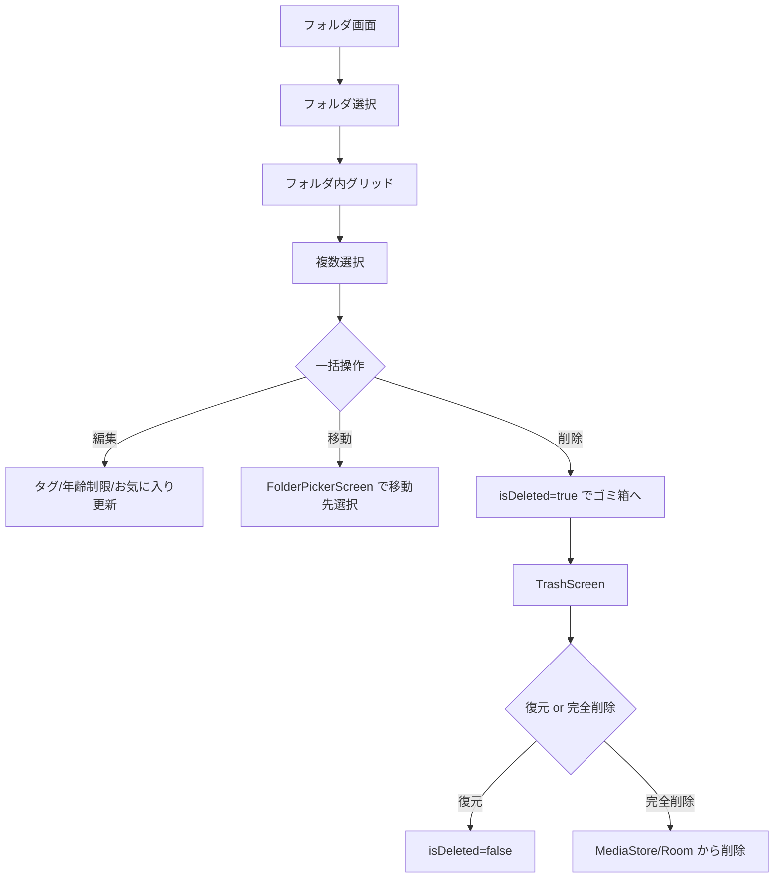
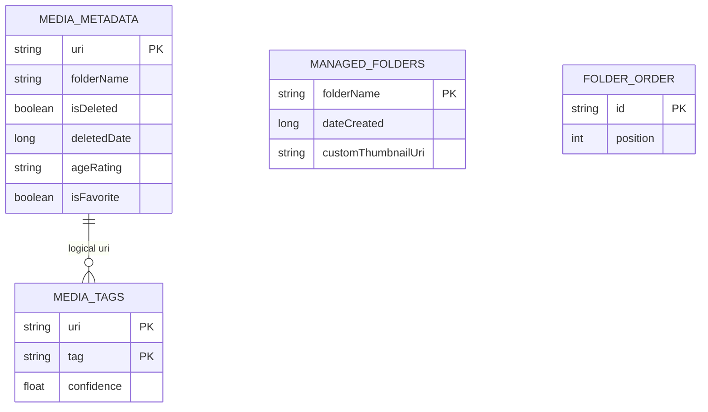
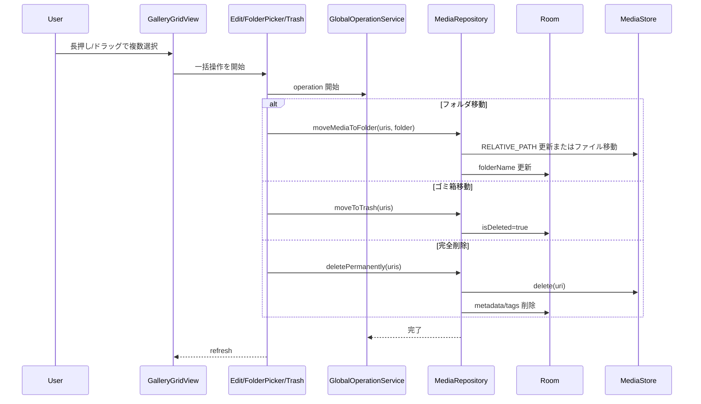

# フォルダ管理・ゴミ箱・一括編集 詳細設計

## 1. 概要

フォルダ単位の整理、複数選択からの一括編集、アプリ内ゴミ箱、復元、完全削除を扱う。

## 2. 利用者向け機能説明

画像をフォルダで整理したり、複数の画像にまとめてタグや年齢制限を付けたりできます。消したい画像はいきなり端末から消さず、まずアプリ内のゴミ箱に移すので、あとから戻せます。

## 3. 開発者向け技術説明

フォルダ情報は MediaStore の `RELATIVE_PATH` と Room の `folderName` / `managed_folders` を組み合わせる。通常削除は `media_metadata.isDeleted` の論理削除、完全削除は ContentResolver delete と Room cleanup を行う。一括操作中の進捗は `GlobalOperationService` が持つ。

## 4. 画面設計

### 4.1. 画面の説明

フォルダ画面は、端末内のメディアを保存場所単位で整理するための画面である。フォルダ一覧から対象フォルダを開き、フォルダ内の画像・GIF・動画を通常ギャラリーと同じグリッドで確認する。フォルダサムネイルを設定すると、次回以降のフォルダ識別がしやすくなる。

一括編集は、選択した複数メディアに対してタグや年齢制限などをまとめて適用するための操作画面である。ゴミ箱画面は、誤削除を避けるための退避場所として機能し、復元するか完全削除するかをユーザーが明示的に選ぶ。

### 4.2. 画面要素

| 画面/部品 | 内容 |
| --- | --- |
| `FolderGalleryScreen` | フォルダ一覧、フォルダ内メディア、フォルダ追加、分析開始 |
| `FolderPickerScreen` | 一括移動先フォルダ選択 |
| `UnifiedMediaEditDialog` | タグ、年齢制限などの一括編集 |
| `TrashScreen` | ゴミ箱一覧、復元、完全削除 |
| `GalleryGridView` | 選択モード、範囲選択、一括操作起点 |

### 4.3. UIモック

| 番号 | UI部品 | 機能 |
| --- | --- | --- |
| 1 | フォルダ作成 | DCIM直下に新規フォルダを作成する。 |
| 2 | フォルダカード | フォルダを開く、表示順やサムネイル設定などの管理を行う。 |
| 3 | フォルダ内グリッド | フォルダ内メディアを通常ギャラリーと同じ操作で表示する。 |
| 4 | 一括操作バー | 選択したメディアを移動、編集、ゴミ箱移動する。 |
| 5 | ゴミ箱操作 | 削除済みメディアを復元または完全削除する。 |

### 4.4. ユースケース図

### 4.5. 画面/操作フロー

## 5. 関連 DB

| テーブル | 用途 |
| --- | --- |
| `media_metadata` | `folderName`, `isDeleted`, `deletedDate`, `ageRating`, `isFavorite` |
| `media_tags` | 一括タグ追加・削除 |
| `managed_folders` | 管理対象フォルダ、カスタムサムネイル |
| `folder_order` | フォルダ表示順 |

## 6. ER 図

## 7. DAO / Repository

| 種別 | 実装 | 役割 |
| --- | --- | --- |
| DAO | `bulkSetDeleted()` | ゴミ箱移動・復元 |
| DAO | `bulkUpdateFavorite()` | 一括お気に入り |
| DAO | `bulkUpdateAgeRating()` | 一括年齢制限 |
| DAO | `bulkUpdateFolderName()` | フォルダ名更新 |
| DAO | `insertManagedFolder()` / `updateFolderThumbnail()` | 管理フォルダ |
| DAO | `insertFolderOrder()` | 表示順保存 |
| Repository | `moveToTrash()` / `restoreFromTrash()` | 論理削除制御 |
| Repository | `deletePermanently()` | ContentResolver と Room の完全削除 |
| Repository | `moveMediaToFolder()` | MediaStore / ファイル移動 |

## 8. シーケンス図

## 9. 補足

- 通常削除と完全削除は必ず分ける。
- フォルダ移動は Android バージョンと URI 種別で MediaStore 更新とファイル移動の両方を考慮する。

## 10. 利用 API・外部連携

| API / ライブラリ | 用途 |
| --- | --- |
| Android `MediaStore` | フォルダ移動、メディア削除、保存場所更新 |
| Android `ContentResolver` | URI 更新、削除、問い合わせ |
| Android `MediaScannerConnection` | ファイル移動後の再スキャン |
| Room | フォルダ、削除状態、一括編集結果の永続化 |
| `GlobalOperationService` | 一括処理の進捗・キャンセル管理 |
