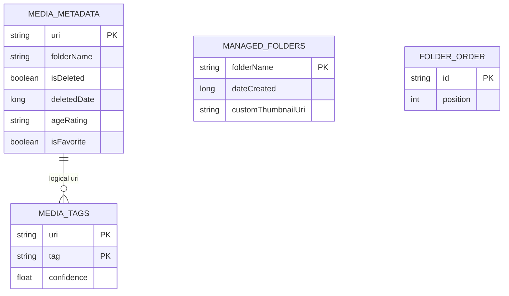
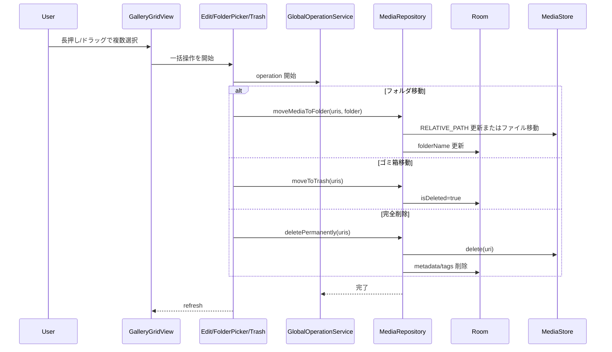

# フォルダ管理・ゴミ箱・一括編集 詳細設計

## 1. 概要

フォルダ単位の整理、複数選択からの一括編集、アプリ内ゴミ箱、復元、完全削除を扱う。

## 2. お客さん目線の説明

画像をフォルダで整理したり、複数の画像にまとめてタグや年齢制限を付けたりできます。消したい画像はいきなり端末から消さず、まずアプリ内のゴミ箱に移すので、あとから戻せます。

## 3. エンジニア目線の説明

フォルダ情報は MediaStore の `RELATIVE_PATH` と Room の `folderName` / `managed_folders` を組み合わせる。通常削除は `media_metadata.isDeleted` の論理削除、完全削除は ContentResolver delete と Room cleanup を行う。一括操作中の進捗は `GlobalOperationService` が持つ。

## 4. 画面設計

| 画面/部品 | 内容 |
| --- | --- |
| `FolderGalleryScreen` | フォルダ一覧、フォルダ内メディア、フォルダ追加、分析開始 |
| `FolderPickerScreen` | 一括移動先フォルダ選択 |
| `UnifiedMediaEditDialog` | タグ、年齢制限などの一括編集 |
| `TrashScreen` | ゴミ箱一覧、復元、完全削除 |
| `GalleryGridView` | 選択モード、範囲選択、一括操作起点 |

## 5. 関連 DB

| テーブル | 用途 |
| --- | --- |
| `media_metadata` | `folderName`, `isDeleted`, `deletedDate`, `ageRating`, `isFavorite` |
| `media_tags` | 一括タグ追加・削除 |
| `managed_folders` | 管理対象フォルダ、カスタムサムネイル |
| `folder_order` | フォルダ表示順 |

## 6. ER 図

## 7. DAO / Repository

| 種別 | 実装 | 役割 |
| --- | --- | --- |
| DAO | `bulkSetDeleted()` | ゴミ箱移動・復元 |
| DAO | `bulkUpdateFavorite()` | 一括お気に入り |
| DAO | `bulkUpdateAgeRating()` | 一括年齢制限 |
| DAO | `bulkUpdateFolderName()` | フォルダ名更新 |
| DAO | `insertManagedFolder()` / `updateFolderThumbnail()` | 管理フォルダ |
| DAO | `insertFolderOrder()` | 表示順保存 |
| Repository | `moveToTrash()` / `restoreFromTrash()` | 論理削除制御 |
| Repository | `deletePermanently()` | ContentResolver と Room の完全削除 |
| Repository | `moveMediaToFolder()` | MediaStore / ファイル移動 |

## 8. シーケンス図

## 9. 補足

- 通常削除と完全削除は必ず分ける。
- フォルダ移動は Android バージョンと URI 種別で MediaStore 更新とファイル移動の両方を考慮する。
