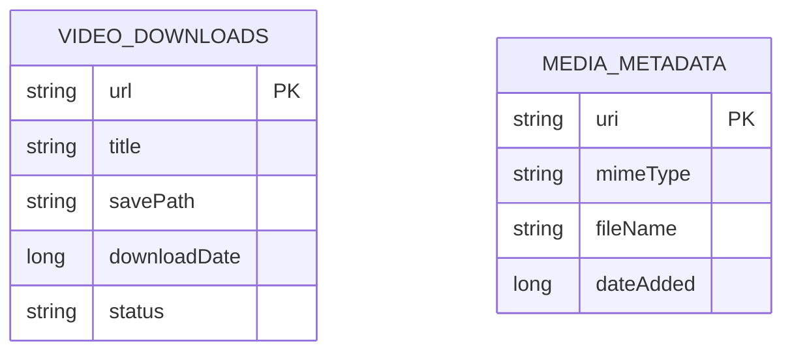
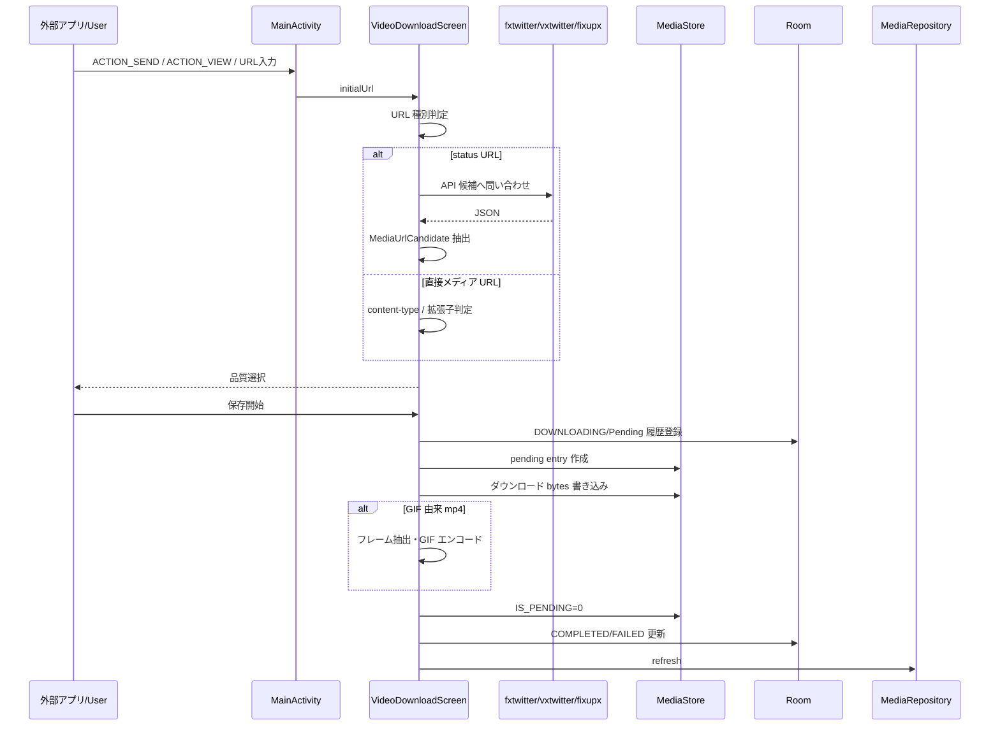

# X / Twitter ダウンロード 詳細設計

## 1. 概要

X / Twitter の共有 URL、VIEW URL、クリップボード URL、手入力 URL、直接メディア URL から動画・画像・GIF を保存する。

## 2. お客さん目線の説明

X の投稿を共有したり、URL を貼ったりするだけで、動画や画像を端末の Gallery フォルダに保存できます。画質を選べて、GIF は GIF として保存できるように扱います。保存履歴からすぐ開き直すこともできます。

## 3. エンジニア目線の説明

`MainActivity` が `ACTION_SEND` と `ACTION_VIEW` を受け、`VideoDownloadScreen` に `initialUrl` を渡す。status URL は fxtwitter / vxtwitter / fixupx API 候補で JSON 解決し、`MediaUrlCandidate` に正規化する。保存は MediaStore の pending entry に stream copy し、履歴を `video_downloads` に保存する。

## 4. 画面設計

| 領域 | 内容 |
| --- | --- |
| URL 入力 | 共有 URL、クリップボード、手入力 |
| 候補解決 | status URL / 直接 URL を判定 |
| 品質選択 | High / Medium / Low、GIF 専用選択 |
| 履歴 | 保存済み URL、タイトル、保存先、状態 |
| プレビュー | 保存済みメディアを `MediaViewerScreen` で開く |
| HOME | ダイアログ表示中でもホームへ戻れる導線 |

## 5. 関連 DB

| テーブル | 用途 |
| --- | --- |
| `video_downloads` | URL、タイトル、保存先、日時、状態 |
| `media_metadata` | 保存後のギャラリー再スキャンで反映 |

## 6. ER 図

## 7. DAO / Repository

| 種別 | 実装 | 役割 |
| --- | --- | --- |
| DAO | `insertVideoDownload()` | 履歴登録・状態更新 |
| DAO | `getAllVideoDownloads()` | 履歴表示 |
| DAO | `isVideoDownloaded()` | 重複判定 |
| DAO | `clearVideoDownloadHistory()` | 履歴削除 |
| UI/Logic | `resolveXVideoUrls()` | API から候補 URL 解決 |
| UI/Logic | `startDownloadTask()` | MediaStore 保存、履歴更新 |
| UI/Logic | `transcodeMp4ToGif()` | GIF 由来 mp4 の GIF 保存 |

## 8. シーケンス図

## 9. 補足

- `isGifSource` を保存候補に持たせ、GIF が mp4 として誤保存されることを避ける。
- 外部 API の JSON 形状変更に備え、複数ホストと複数キーを探索する。
- m3u8 は直接保存対象から除外する。
