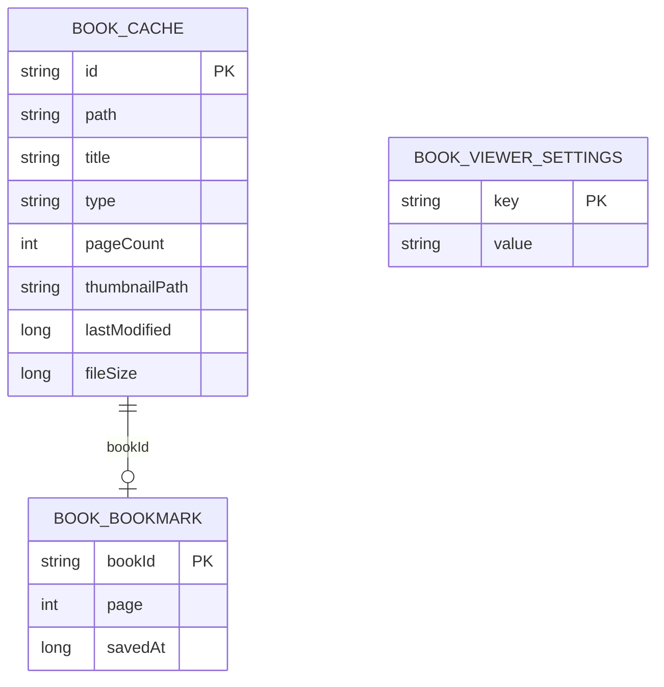
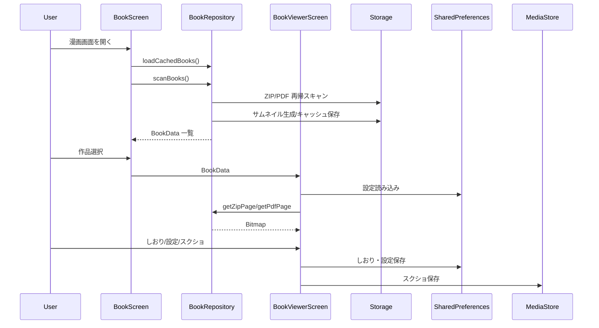

# 漫画ビューア 詳細設計

## 1. 概要

端末ストレージ上の ZIP / PDF 漫画ファイルをスキャンし、ページ単位で閲覧する。しおり、見開き、表示品質、ページスクリーンショット保存に対応する。

## 2. お客さん目線の説明

ZIP や PDF の漫画をアプリ内で読めます。横画面では見開き、縦画面では 1 ページなど、読みやすい表示に切り替えられます。途中まで読んだ作品はしおりから戻れます。

## 3. エンジニア目線の説明

`BookRepository` が外部ストレージを再帰走査し、ZIP は `ZipFile`、PDF は `PdfRenderer` でページ数とサムネイルを取得する。`BookViewerScreen` は SharedPreferences に表示設定としおりを保存し、ページ Bitmap は必要時にロードする。

## 4. 画面設計

| 画面 | 内容 |
| --- | --- |
| `BookScreen` | ZIP / PDF 一覧、スキャン、サムネイル表示 |
| `BookViewerScreen` | ページ表示、ページ移動、見開き、設定、しおり |
| `BookBookmarksScreen` | しおり一覧、該当作品・ページへのジャンプ |

| 設定 | 値 |
| --- | --- |
| ページレイアウト | AUTO / SINGLE / DOUBLE |
| 読み方向 | RIGHT_TO_LEFT / LEFT_TO_RIGHT |
| フィット | SCREEN / WIDTH / HEIGHT |
| 背景 | BLACK / GRAY / WHITE |
| 描画品質 | STANDARD / HIGH |
| その他 | ページ間隔、プリロード、タップナビゲーション、画面常時点灯 |

## 5. 関連 DB

Room DB は使わない。以下をファイル・SharedPreferences に保存する。

| 保存先 | 用途 |
| --- | --- |
| BookRepository cache index | スキャン済み漫画、ページ数、サムネイル、更新日時、サイズ |
| `book_bookmarks` | しおり |
| `BOOK_VIEWER_PREFS` | ビューア設定 |
| MediaStore | ページスクリーンショット保存 |

## 6. ER 図

## 7. DAO / Repository

| 種別 | 実装 | 役割 |
| --- | --- | --- |
| Repository | `BookRepository.scanBooks()` | ZIP/PDF スキャン、キャッシュ更新 |
| Repository | `loadCachedBooks()` | 起動直後の高速表示 |
| Repository | `getZipPage()` | ZIP 内画像を Bitmap 化 |
| Repository | `getPdfPage()` | PDF ページを Bitmap 化 |
| UI | `BookViewerScreen` | ページロード、設定、しおり、スクショ |
| Storage | SharedPreferences | しおり・設定 |

## 8. シーケンス図

## 9. 補足

- 全ファイルスキャンには `MANAGE_EXTERNAL_STORAGE` が必要になる。
- キャッシュはファイル更新日時とサイズで再利用可否を判断する。
- 高画質設定は読み込みコストが高いため、標準品質を既定にする。
