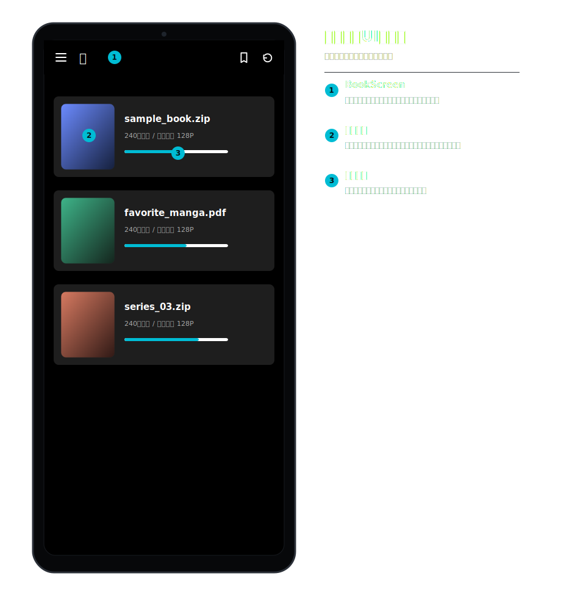
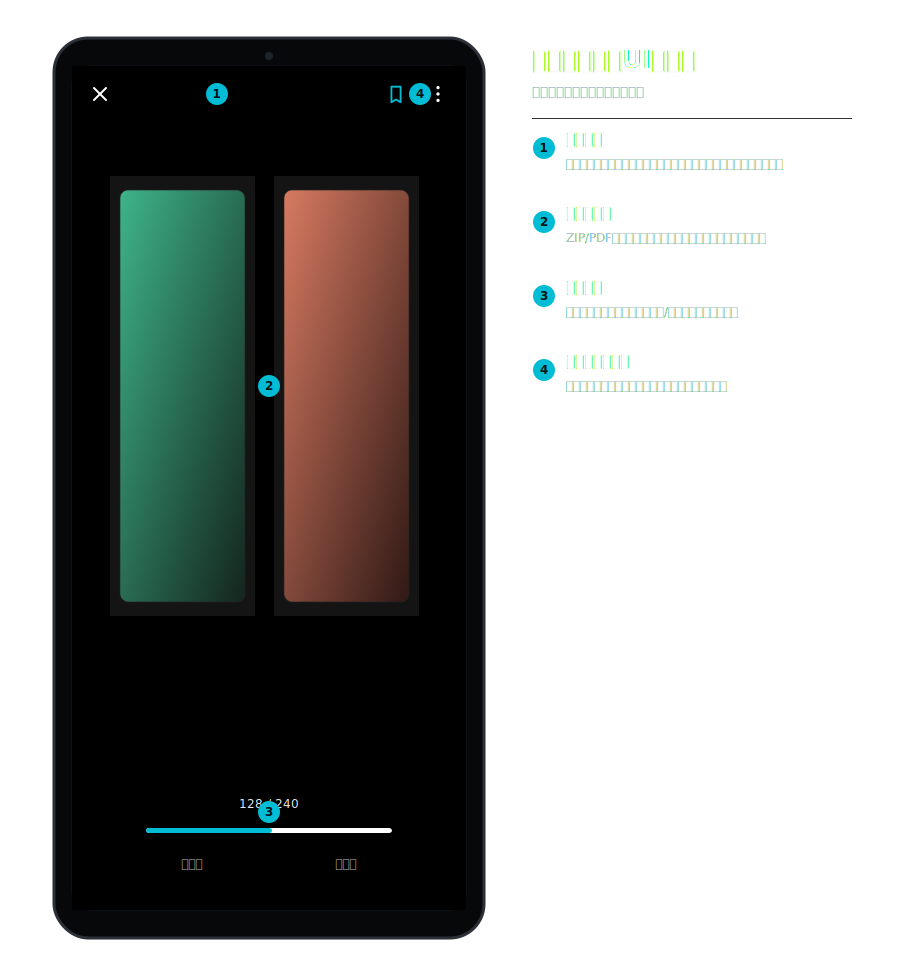
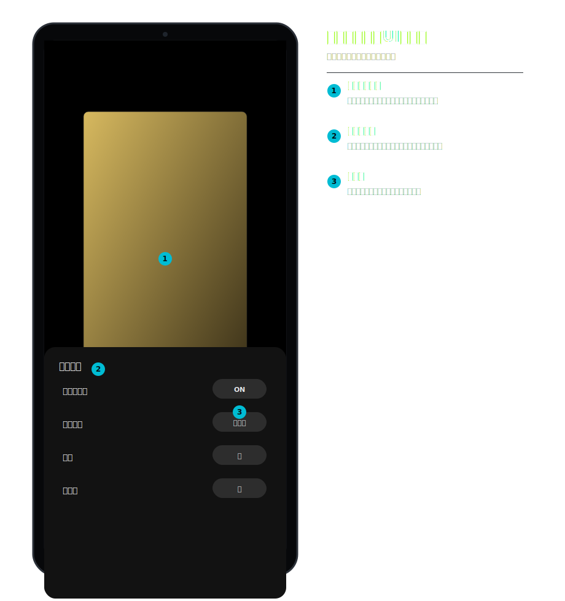
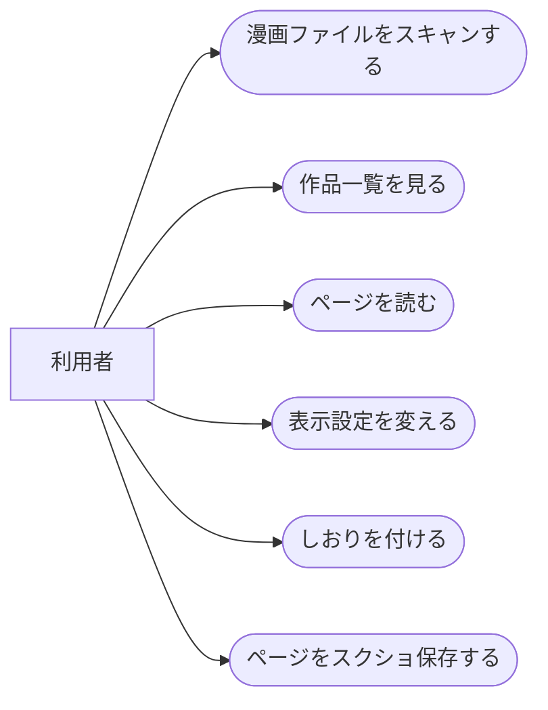
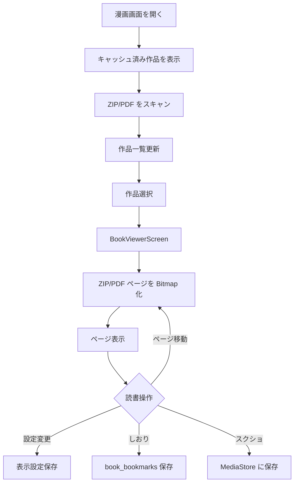
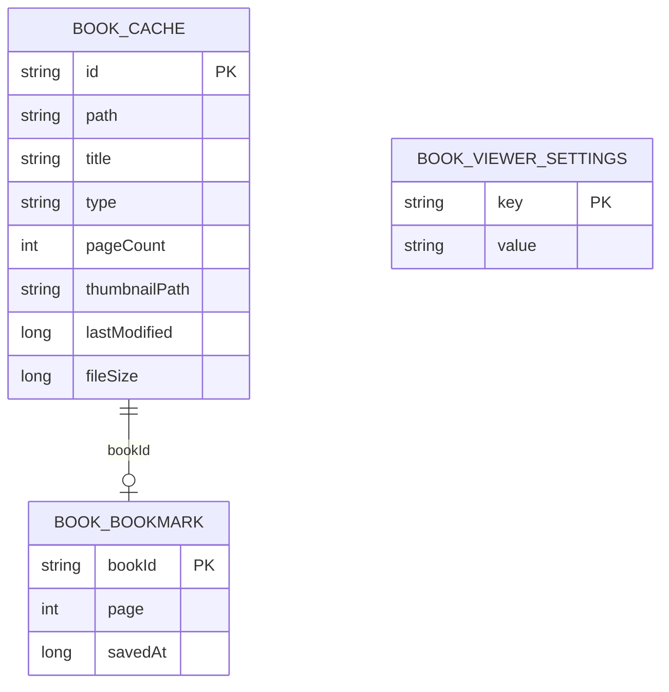
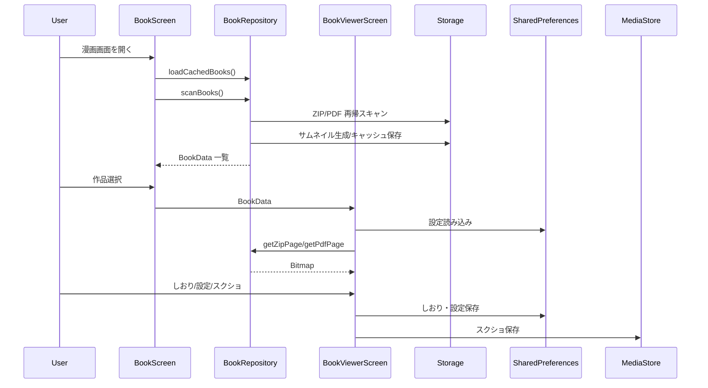

# 漫画ビューア 詳細設計

## 1. 概要

端末ストレージ上の ZIP / PDF 漫画ファイルをスキャンし、ページ単位で閲覧する。しおり、見開き、表示品質、ページスクリーンショット保存に対応する。

## 2. 利用者向け機能説明

ZIP や PDF の漫画をアプリ内で読めます。横画面では見開き、縦画面では 1 ページなど、読みやすい表示に切り替えられます。途中まで読んだ作品はしおりから戻れます。

## 3. 開発者向け技術説明

`BookRepository` が外部ストレージを再帰走査し、ZIP は `ZipFile`、PDF は `PdfRenderer` でページ数とサムネイルを取得する。`BookViewerScreen` は SharedPreferences に表示設定としおりを保存し、ページ Bitmap は必要時にロードする。

## 4. 画面設計

### 4.1. 画面の説明

漫画画面は、端末ストレージ内の ZIP / PDF を作品一覧として表示する画面である。作品カードにはタイトル、ページ数、サムネイルを表示し、ユーザーは読みたい作品を選ぶ。キャッシュ済み情報を先に出すことで、スキャン中でも一覧を確認しやすくする。

漫画ビューアは、読書中の画面占有を優先したページ表示画面である。縦画面では単ページ、横画面では見開きなど、端末の向きや設定に応じて表示を切り替える。しおり、ページスライダー、表示設定、スクリーンショット保存を備え、長い作品でも途中から再開しやすい。

### 4.2. 画面要素

| 画面 | 内容 |
| --- | --- |
| `BookScreen` | ZIP / PDF 一覧、スキャン、サムネイル表示 |
| `BookViewerScreen` | ページ表示、ページ移動、見開き、設定、しおり |
| `BookBookmarksScreen` | しおり一覧、該当作品・ページへのジャンプ |

| 設定 | 値 |
| --- | --- |
| ページレイアウト | AUTO / SINGLE / DOUBLE |
| 読み方向 | RIGHT_TO_LEFT / LEFT_TO_RIGHT |
| フィット | SCREEN / WIDTH / HEIGHT |
| 背景 | BLACK / GRAY / WHITE |
| 描画品質 | STANDARD / HIGH |
| その他 | ページ間隔、プリロード、タップナビゲーション、画面常時点灯 |

### 4.3. UIモック

#### 漫画一覧

#### 漫画ビューア

#### 表示設定パネル

| 番号 | UI部品 | 機能 |
| --- | --- | --- |
| 1 | 漫画一覧 | 表紙、ファイル名、ページ数、最終閲覧位置、読書進捗を表示する。 |
| 2 | 漫画ビューア | ZIP/PDFを単ページまたは見開きで黒背景に表示する。 |
| 3 | ビューア操作 | 閉じる、しおり、その他メニュー、ページシーク、前後本移動を行う。 |
| 4 | 表示設定パネル | 表示形式、読む方向、背景、先読みなどをビューア上で変更する。 |

### 4.4. ユースケース図

### 4.5. 画面/操作フロー

## 5. 関連 DB

Room DB は使わない。以下をファイル・SharedPreferences に保存する。

| 保存先 | 用途 |
| --- | --- |
| BookRepository cache index | スキャン済み漫画、ページ数、サムネイル、更新日時、サイズ |
| `book_bookmarks` | しおり |
| `BOOK_VIEWER_PREFS` | ビューア設定 |
| MediaStore | ページスクリーンショット保存 |

## 6. ER 図

## 7. DAO / Repository

| 種別 | 実装 | 役割 |
| --- | --- | --- |
| Repository | `BookRepository.scanBooks()` | ZIP/PDF スキャン、キャッシュ更新 |
| Repository | `loadCachedBooks()` | 起動直後の高速表示 |
| Repository | `getZipPage()` | ZIP 内画像を Bitmap 化 |
| Repository | `getPdfPage()` | PDF ページを Bitmap 化 |
| UI | `BookViewerScreen` | ページロード、設定、しおり、スクショ |
| Storage | SharedPreferences | しおり・設定 |

## 8. シーケンス図

## 9. 補足

- 全ファイルスキャンには `MANAGE_EXTERNAL_STORAGE` が必要になる。
- キャッシュはファイル更新日時とサイズで再利用可否を判断する。
- 高画質設定は読み込みコストが高いため、標準品質を既定にする。

## 10. 利用 API・外部連携

| API / ライブラリ | 用途 |
| --- | --- |
| Android `PdfRenderer` | PDF ページのレンダリング |
| `java.util.zip.ZipFile` | ZIP 内画像ページの読み取り |
| Android `MediaStore` | ページスクリーンショット保存 |
| Android `MANAGE_EXTERNAL_STORAGE` | ZIP / PDF の端末ストレージスキャン |
| SharedPreferences | しおり、ビューア設定 |
