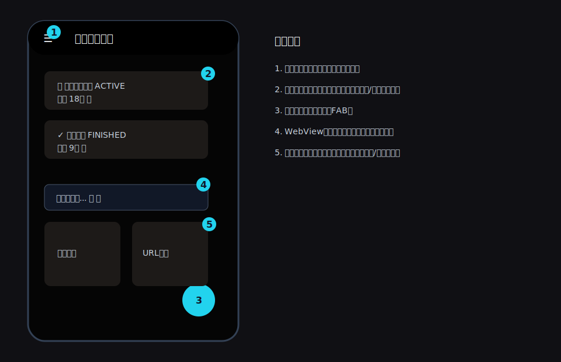
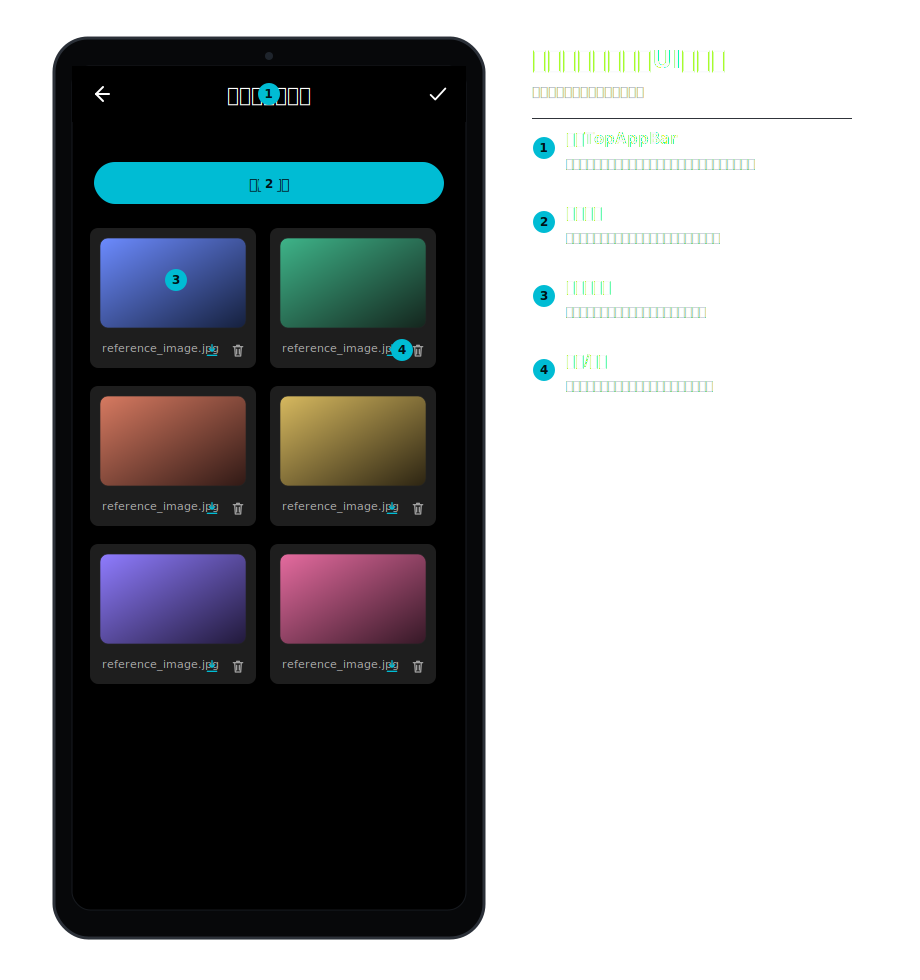
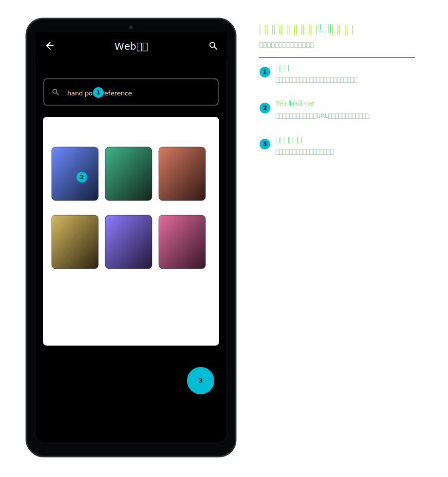
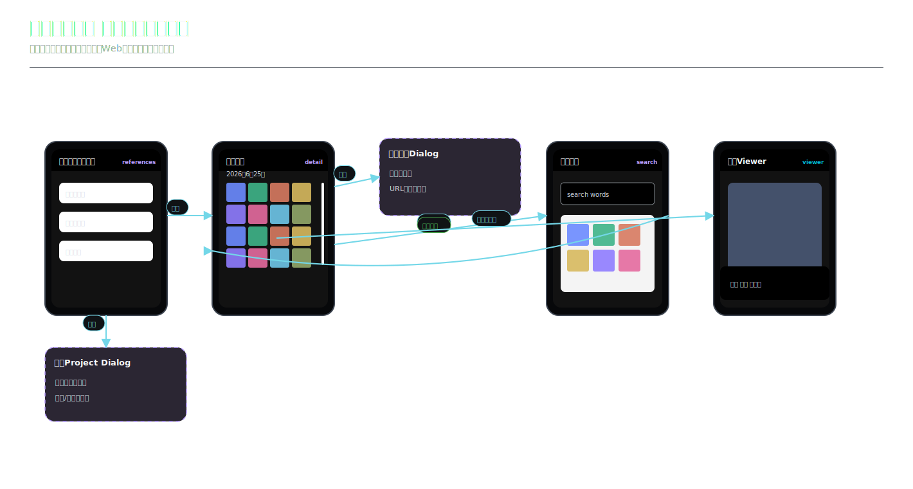
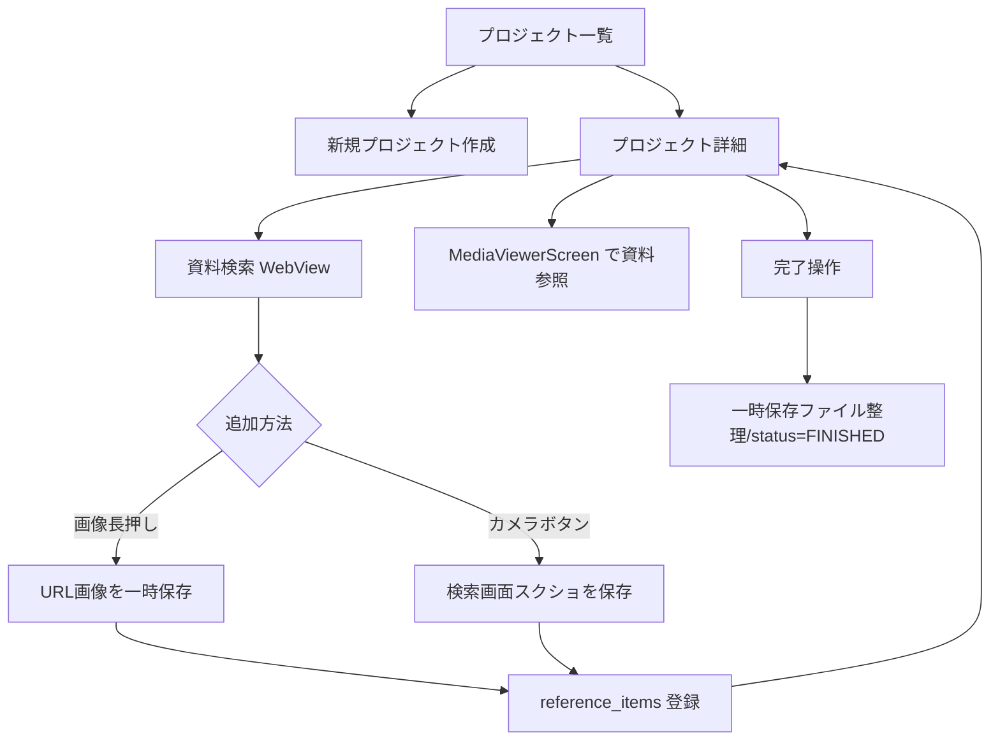
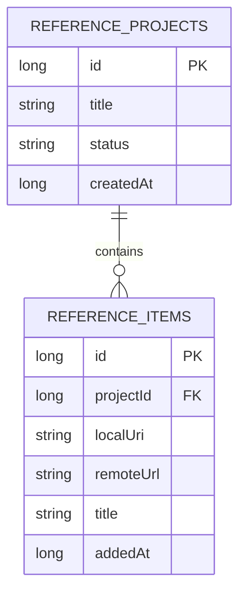
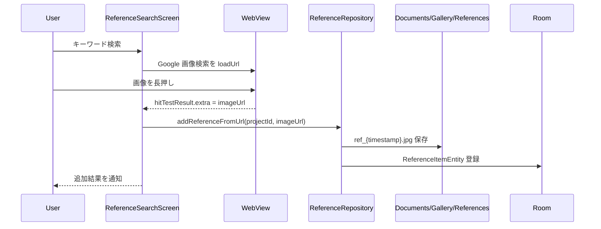
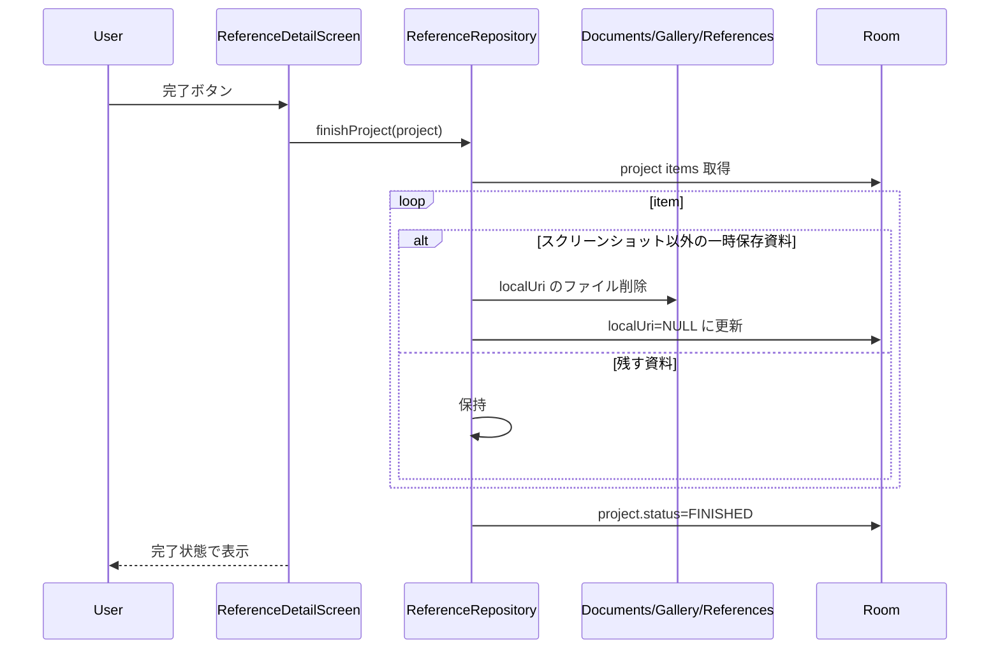

# お絵描き資料参照プロジェクト 詳細設計

## 1. 概要

参照プロジェクトは、イラスト制作中に必要な資料画像をプロジェクト単位で一時収集し、制作中にすぐ見返せるようにするお絵描き補助ツールである。制作が終わったら一時保存した資料を整理し、必要な情報だけ残す。

## 2. 利用者向け機能説明

絵を描くときに、ポーズ、服、背景、小物、色味などの参考画像をひとまとめにできます。アプリ内の検索画面から画像を探して、長押しで資料に追加できます。検索画面そのものをスクショして資料にすることもできます。描き終わったプロジェクトは完了扱いにして、一時的に保存した資料を整理できます。

## 3. 開発者向け技術説明

`ReferenceProjectEntity` が制作単位、`ReferenceItemEntity` が資料画像 1 件を表す。`ReferenceRepository` は Room と `Documents/Gallery/References/{projectId}` の一時ファイルを同期する。検索は `ReferenceSearchScreen` 内の WebView で行い、画像長押しの hitTestResult または画面スクリーンショットを資料として登録する。

## 4. 画面設計

### 4.1. 画面の説明

お絵描き資料参照プロジェクト画面は、制作中のイラストごとに参考資料をまとめる作業スペースである。プロジェクト一覧では「今描いているもの」「描き終わったもの」を分けて確認でき、制作単位で資料を開ける。

プロジェクト詳細では、集めた資料を 2 列グリッドで並べ、必要な画像をタップして全画面で見返す。検索画面では WebView で画像検索を行い、画像長押しで資料追加、カメラボタンで検索画面のスクリーンショット保存ができる。完了操作は「制作が終わったので一時資料を片付ける」ための操作として扱う。

### 4.2. 画面要素

| 画面 | 内容 |
| --- | --- |
| `ReferenceProjectScreen` | プロジェクト一覧、新規作成、削除、進行中/完了表示 |
| `ReferenceDetailScreen` | 2 列グリッドで資料表示、全画面参照、個別削除、未保存資料の保存、完了/再開 |
| `ReferenceSearchScreen` | WebView 画像検索、キーワード検索、画像長押し追加、画面スクショ保存 |
| `MediaViewerScreen` | 資料画像の全画面表示。通常ギャラリー操作は抑制する。 |

### 4.3. UIモック

#### プロジェクト一覧

#### 資料詳細

#### Web検索・スクショ保存

| 番号 | UI部品 | 機能 |
| --- | --- | --- |
| 1 | プロジェクト一覧 | 制作単位の資料セット、進行中/完了状態、削除操作を表示する。 |
| 2 | 新規作成FAB | 新しいお絵描き資料プロジェクトを作成する。 |
| 3 | 資料詳細 | プロジェクト内の参考画像を2列カードで表示し、保存/削除できる。 |
| 4 | 資料追加 | 端末画像またはWeb検索から資料を追加する。 |
| 5 | Web検索 | 検索結果をWebViewで表示し、画像追加や検索画面スクショ保存を行う。 |

### 4.4. 機能内画面遷移図

資料プロジェクト一覧、新規作成ダイアログ、資料詳細、完了確認、Web検索、資料ビューアの流れを、画面タイトル付きのミニUIモックと矢印で示す。

### 4.5. ユースケース図

```mermaid
flowchart LR
    User["利用者"] --> UC1(["資料プロジェクトを作る"])
    User --> UC2(["画像検索する"])
    User --> UC3(["画像を長押しで追加する"])
    User --> UC4(["検索画面をスクショ保存する"])
    User --> UC5(["資料を全画面で参照する"])
    User --> UC6(["プロジェクトを完了する"])
    UC6 --> Cleanup(["一時資料を整理する"])
```

### 4.6. 画面/操作フロー

## 5. 関連 DB

| テーブル | 用途 |
| --- | --- |
| `reference_projects` | 制作プロジェクトのタイトル、状態、作成日時 |
| `reference_items` | 資料画像のローカル保存先、元 URL、タイトル、追加日時 |

## 6. ER 図

## 7. DAO / Repository

| 種別 | 実装 | 役割 |
| --- | --- | --- |
| DAO | `getAllProjectsFlow()` | プロジェクト一覧 |
| DAO | `insertProject()` / `updateProject()` / `deleteProject()` | プロジェクト CRUD |
| DAO | `getItemsForProjectFlow()` | 資料グリッド |
| DAO | `insertItem()` / `updateItem()` / `deleteItem()` | 資料 CRUD |
| DAO | `clearLocalUrisForProject()` | ローカル保存解除用 |
| Repository | `addReferenceFromUrl()` | URL 画像を一時フォルダへ保存して item 登録 |
| Repository | `addLocalItemForProject()` | スクリーンショットなどローカル資料を item 登録 |
| Repository | `downloadItemToLocal()` | URL 参照を再度ローカル保存 |
| Repository | `finishProject()` | 完了時に一時保存資料を整理し、プロジェクトを FINISHED にする |
| Repository | `deleteProject()` | 一時フォルダごと削除し、Room の CASCADE で item 削除 |

## 8. シーケンス図

### 8.1. 画像検索から資料追加

### 8.2. プロジェクト完了

## 9. 補足

- この機能の主目的は「作品制作中の資料置き場」であり、恒久的な写真管理ではない。
- `remoteUrl` を残すことで、一時ファイル削除後も必要に応じて再取得できる。
- スクリーンショット資料は Web ページ上の複数要素や検索結果の雰囲気を残す用途があるため、完了時にも残す設計になっている。
- WebView は外部サイト依存のため、画像 URL が取得できないページもある。

## 10. 利用 API・外部連携

| API / ライブラリ | 用途 |
| --- | --- |
| Android WebView | Google 画像検索、資料探し |
| Google 画像検索 | お絵描き資料の検索元。公式 API ではなく通常 Web ページ表示 |
| OkHttp | 画像 URL のダウンロード |
| Android 外部ストレージ | `Documents/Gallery/References/{projectId}` への一時保存 |
| Room | プロジェクトと資料アイテム管理 |
| Coil | 資料サムネイル表示 |
