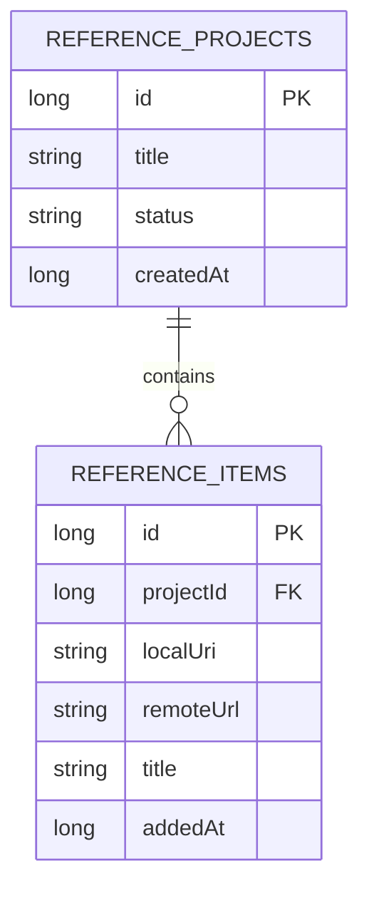
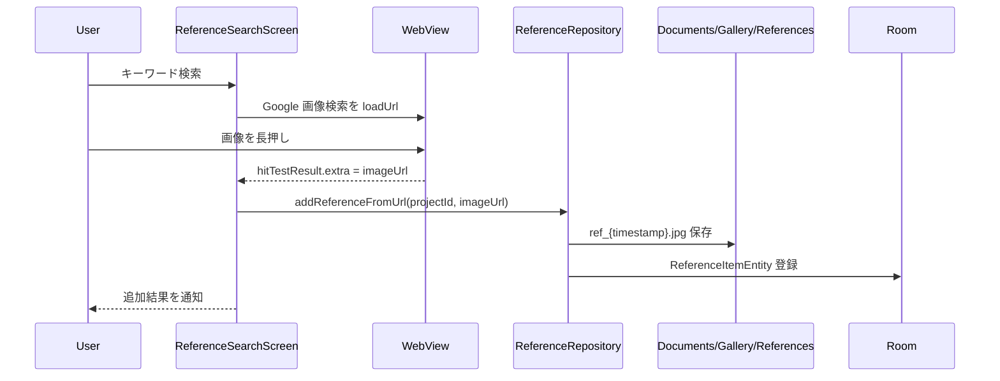
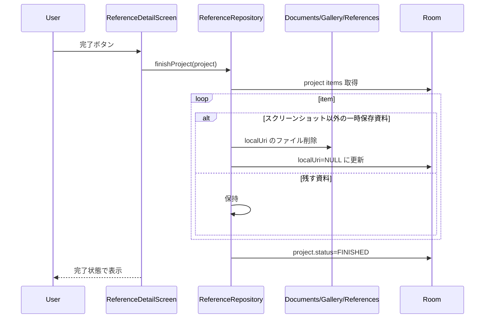

# お絵描き資料参照プロジェクト 詳細設計

## 1. 概要

参照プロジェクトは、イラスト制作中に必要な資料画像をプロジェクト単位で一時収集し、制作中にすぐ見返せるようにするお絵描き補助ツールである。制作が終わったら一時保存した資料を整理し、必要な情報だけ残す。

## 2. お客さん目線の説明

絵を描くときに、ポーズ、服、背景、小物、色味などの参考画像をひとまとめにできます。アプリ内の検索画面から画像を探して、長押しで資料に追加できます。検索画面そのものをスクショして資料にすることもできます。描き終わったプロジェクトは完了扱いにして、一時的に保存した資料を整理できます。

## 3. エンジニア目線の説明

`ReferenceProjectEntity` が制作単位、`ReferenceItemEntity` が資料画像 1 件を表す。`ReferenceRepository` は Room と `Documents/Gallery/References/{projectId}` の一時ファイルを同期する。検索は `ReferenceSearchScreen` 内の WebView で行い、画像長押しの hitTestResult または画面スクリーンショットを資料として登録する。

## 4. 画面設計

| 画面 | 内容 |
| --- | --- |
| `ReferenceProjectScreen` | プロジェクト一覧、新規作成、削除、進行中/完了表示 |
| `ReferenceDetailScreen` | 2 列グリッドで資料表示、全画面参照、個別削除、未保存資料の保存、完了/再開 |
| `ReferenceSearchScreen` | WebView 画像検索、キーワード検索、画像長押し追加、画面スクショ保存 |
| `MediaViewerScreen` | 資料画像の全画面表示。通常ギャラリー操作は抑制する。 |

## 5. 関連 DB

| テーブル | 用途 |
| --- | --- |
| `reference_projects` | 制作プロジェクトのタイトル、状態、作成日時 |
| `reference_items` | 資料画像のローカル保存先、元 URL、タイトル、追加日時 |

## 6. ER 図

## 7. DAO / Repository

| 種別 | 実装 | 役割 |
| --- | --- | --- |
| DAO | `getAllProjectsFlow()` | プロジェクト一覧 |
| DAO | `insertProject()` / `updateProject()` / `deleteProject()` | プロジェクト CRUD |
| DAO | `getItemsForProjectFlow()` | 資料グリッド |
| DAO | `insertItem()` / `updateItem()` / `deleteItem()` | 資料 CRUD |
| DAO | `clearLocalUrisForProject()` | ローカル保存解除用 |
| Repository | `addReferenceFromUrl()` | URL 画像を一時フォルダへ保存して item 登録 |
| Repository | `addLocalItemForProject()` | スクリーンショットなどローカル資料を item 登録 |
| Repository | `downloadItemToLocal()` | URL 参照を再度ローカル保存 |
| Repository | `finishProject()` | 完了時に一時保存資料を整理し、プロジェクトを FINISHED にする |
| Repository | `deleteProject()` | 一時フォルダごと削除し、Room の CASCADE で item 削除 |

## 8. シーケンス図

### 8.1. 画像検索から資料追加

### 8.2. プロジェクト完了

## 9. 補足

- この機能の主目的は「作品制作中の資料置き場」であり、恒久的な写真管理ではない。
- `remoteUrl` を残すことで、一時ファイル削除後も必要に応じて再取得できる。
- スクリーンショット資料は Web ページ上の複数要素や検索結果の雰囲気を残す用途があるため、完了時にも残す設計になっている。
- WebView は外部サイト依存のため、画像 URL が取得できないページもある。
