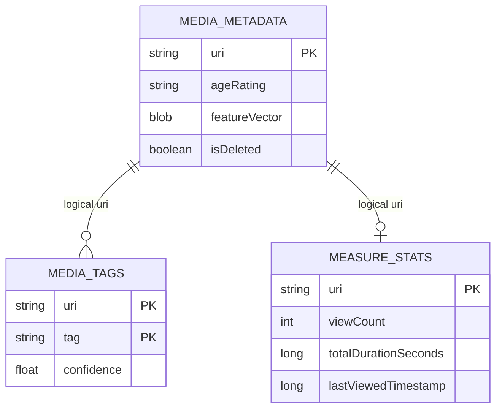
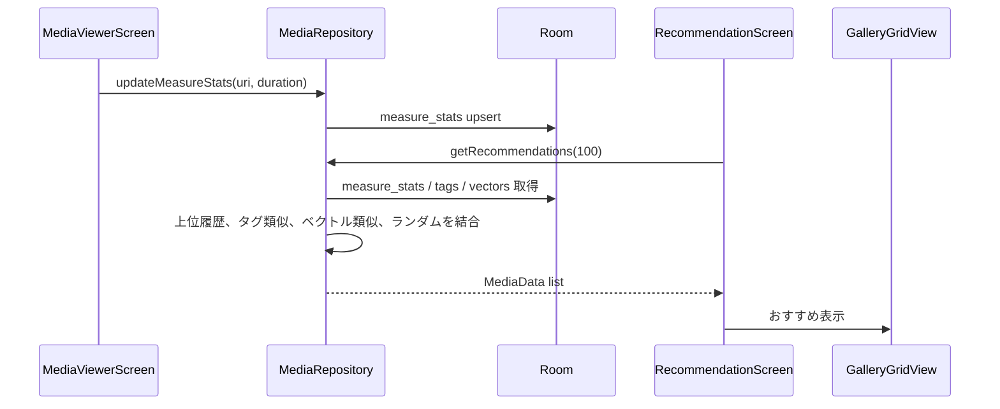

# おすすめ・視聴履歴 詳細設計

## 1. 概要

閲覧回数・閲覧時間、タグ類似、画像ベクトル類似、ランダム候補を組み合わせておすすめメディアを表示する。

## 2. お客さん目線の説明

よく見ている画像や、それに似たタグ・雰囲気の画像をおすすめとして表示します。大量の画像から、見返したいものや近い雰囲気のものを探しやすくします。

## 3. エンジニア目線の説明

ビューアが閲覧時間を `measure_stats` に保存し、`MediaRepository.getRecommendations()` が上位履歴を起点にタグ類似とベクトル類似を展開する。足りない分はランダム候補で補う。

## 4. 画面設計

| 画面/部品 | 内容 |
| --- | --- |
| `RecommendationScreen` | おすすめ 100 件を読み込み、`GalleryGridView` で表示 |
| `MediaViewerScreen` | 上スワイプで関連タブ、タグ類似・ベクトル類似表示 |
| `GalleryGridView` | おすすめから開いたメディアも通常ビューアに接続 |

## 5. 関連 DB

| テーブル | 用途 |
| --- | --- |
| `measure_stats` | 閲覧回数、合計閲覧時間、最終閲覧日時 |
| `media_tags` | タグ類似計算 |
| `media_metadata` | 特徴ベクトル、年齢制限、削除状態 |

## 6. ER 図

## 7. DAO / Repository

| 種別 | 実装 | 役割 |
| --- | --- | --- |
| DAO | `getMeasureStats()` / `insertMeasureStats()` | 閲覧統計の取得・保存 |
| DAO | `getAllMeasureStatsFlow()` | 推薦起点の取得 |
| DAO | `getAllTagsWithUris()` | タグ類似用 |
| DAO | `getVectorsByRating()` / `getAllVectors()` | ベクトル類似用 |
| Repository | `updateMeasureStats()` | 閲覧統計加算 |
| Repository | `getRecommendations()` | おすすめ候補生成 |
| Repository | `findMediaByTagSimilarity()` | タグ一致率で類似候補 |
| Repository | `findSimilarVisualMedia()` | コサイン類似度で画像類似候補 |

## 8. シーケンス図

## 9. 補足

- 視聴履歴が少ない場合はランダム候補が中心になる。
- ベクトル類似は `featureVector` が保存済みの画像だけが対象になる。
- 削除済みメディアを推薦に混ぜないよう metadata 側の削除状態に注意する。
