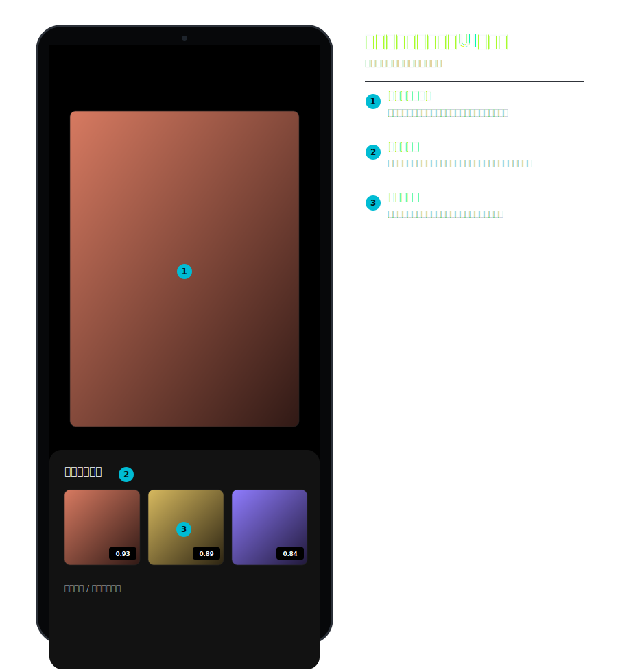
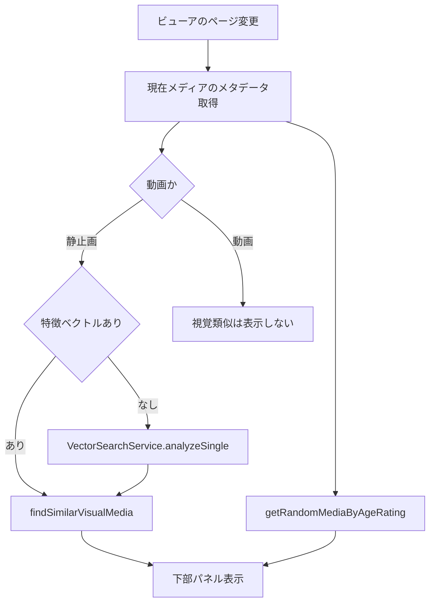

# 関連メディアパネル 詳細設計

## 1. 概要

関連メディアは独立画面ではなく、`MediaViewerScreen` 内に表示するパネルである。静止画では特徴ベクトルによる視覚類似候補、画像・動画では年齢区分を考慮したランダム候補を表示できる。

## 2. 画面設計

| 項目 | 内容 |
| --- | --- |
| 表示場所 | `MediaViewerScreen` の下部パネル |
| 開閉 | 上スワイプ設定、パネルのドラッグ、表示設定 |
| 視覚類似 | 静止画のみ。特徴ベクトルがある場合に `findSimilarVisualMedia()` を呼ぶ。 |
| ランダム候補 | `getRandomMediaByAgeRating()` を用い、現在メディアと同じ年齢区分を優先する。動画では動画だけを候補にする。 |
| 除外 | ゴミ箱表示中は候補を表示しない。 |
| 設定 | ランダム候補、類似候補、パネルサイズ、上スワイプ開閉を個別に設定可能。 |

## 3. 処理フロー

## 4. データ・実装

| 実装 | 役割 |
| --- | --- |
| `MediaViewerScreen` | パネルの表示状態、ドラッグ、候補タップ後のページ遷移 |
| `MediaRepository.findSimilarVisualMedia()` | 特徴ベクトルのコサイン類似度で最大 25 件を抽出 |
| `MediaRepository.getRandomMediaByAgeRating()` | 年齢区分に応じたランダム候補を抽出 |
| `RecommendationCard` | サムネイル、類似度、削除状態を表示 |
| `media_metadata.featureVector` | 視覚類似の入力 |

関連候補の操作と表示は、このビューア内パネルで完結する。
