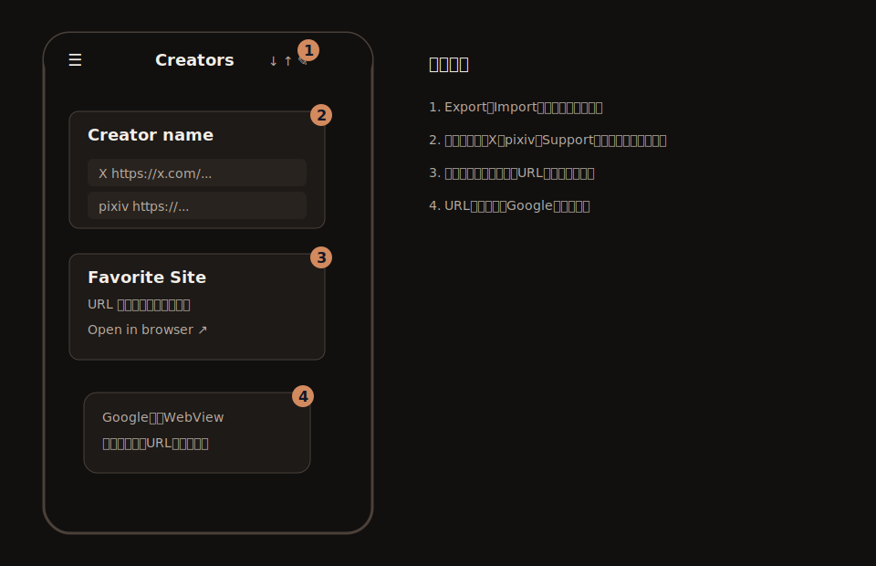
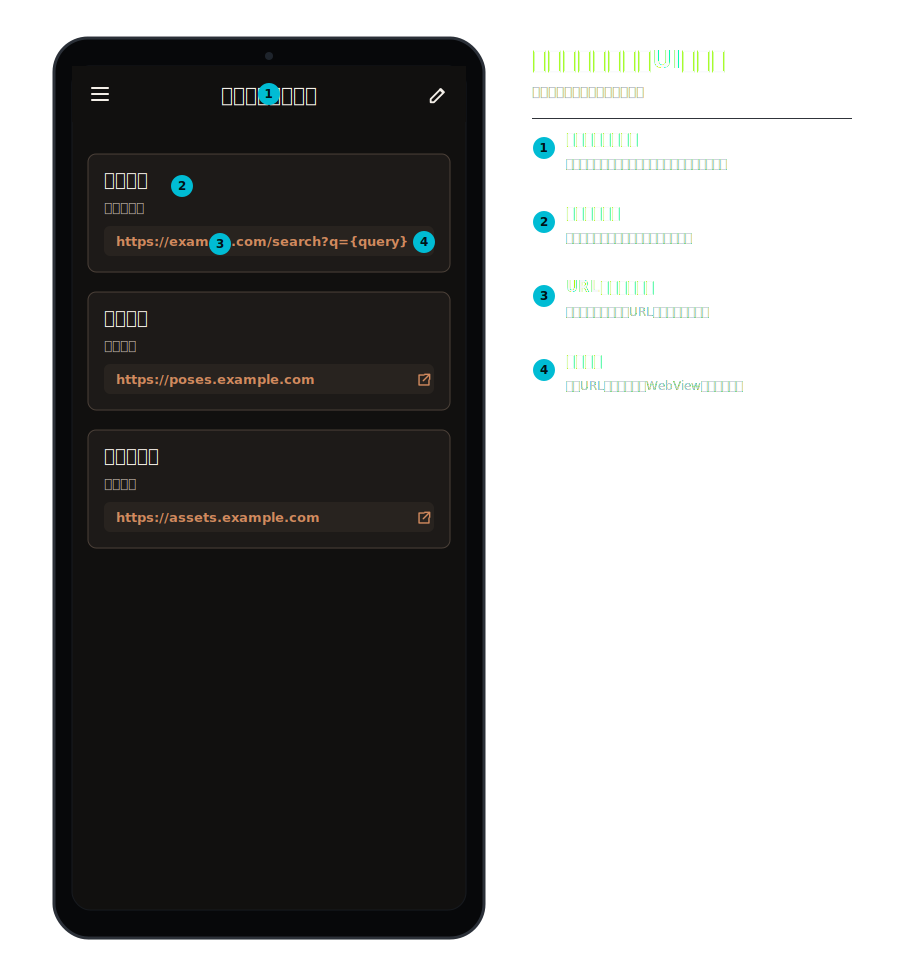
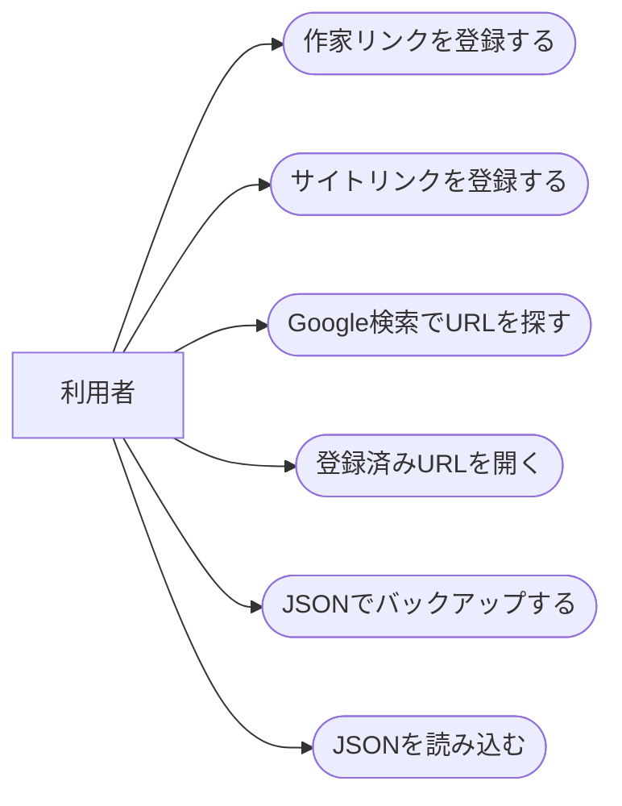
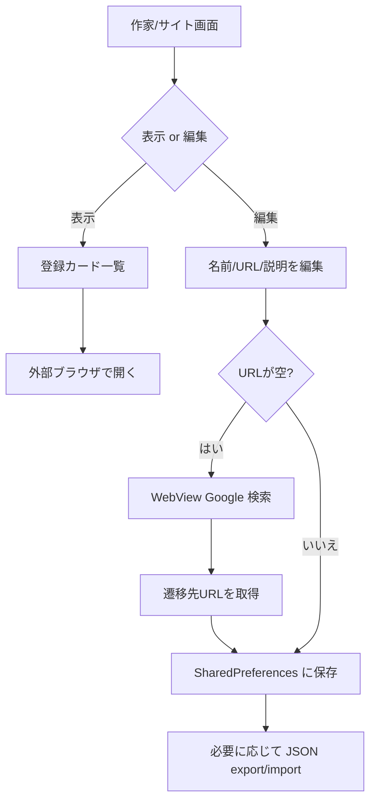
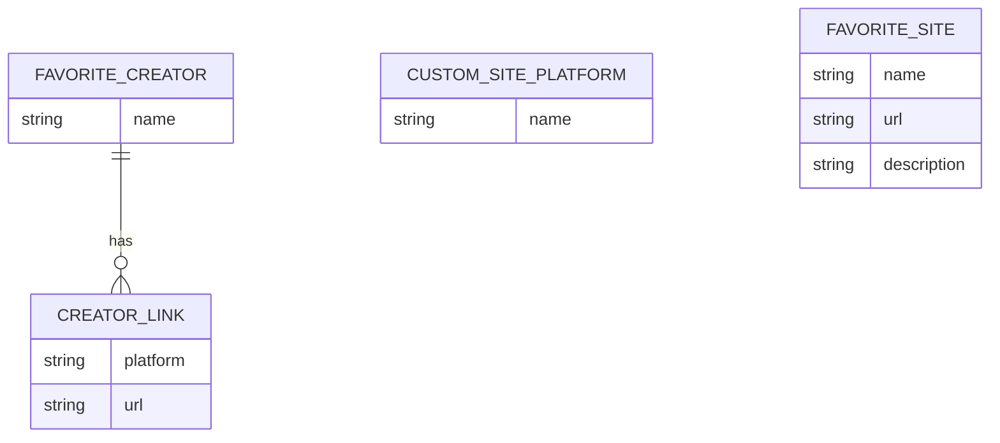
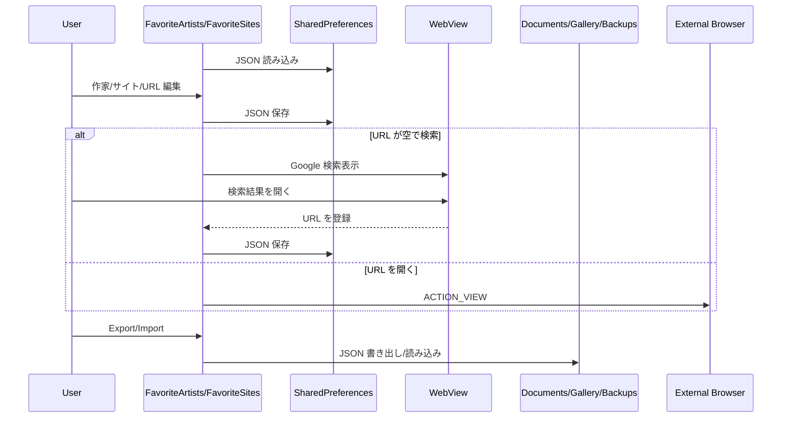

# お気に入り作家・サイト 詳細設計

## 1. 概要

お気に入り作家のリンク集と、お気に入りサイトのリンク集を管理する。Room ではなく SharedPreferences と JSON バックアップを使う軽量機能である。

## 2. 利用者向け機能説明

よく見る作家さんやサイトをアプリ内にまとめられます。X、pixiv、支援サイトなどのリンクを作家ごとに持てます。URL が分からない場合は Google 検索を開いて、見つけたページを登録できます。

## 3. 開発者向け技術説明

`FavoriteArtistsScreen` と `FavoriteSitesScreen` は Compose state と SharedPreferences の JSON 文字列でデータを保持する。バックアップは `Documents/Gallery/Backups` に JSON として export/import する。URL 起動は `ACTION_VIEW`。

## 4. 画面設計

### 4.1. 画面の説明

お気に入り作家画面は、作家ごとに X、pixiv、支援サイトなどのリンクをまとめる画面である。表示モードでは作家カードから各リンクを開き、編集モードでは作家名、リンク種別、URL を登録する。URL が空のときは WebView 検索を開き、見つけたページを登録できる。

お気に入りサイト画面は、作家単位ではなくサイト単位でよく使うページをまとめる画面である。サイト名、URL、説明をカードとして管理し、必要に応じて JSON バックアップで移行できる。どちらもギャラリー本体の Room データとは独立した軽量リンク集として扱う。

### 4.2. 画面要素

| 画面 | 内容 |
| --- | --- |
| `FavoriteArtistsScreen` | Creator tab 一覧、リンク編集、カスタムサイト、検索、import/export |
| `FavoriteSitesScreen` | サイトカード一覧、サイト編集、検索、import/export |
| WebView Dialog | Google 検索から URL を拾う |

### 4.3. UIモック

#### お気に入り作家

#### お気に入りサイト

| 番号 | UI部品 | 機能 |
| --- | --- | --- |
| 1 | お気に入り作家 | 作家名、登録済みリンク、外部表示、追加FABを茶系テーマで表示する。 |
| 2 | 上部操作 | Export、Import、編集モード切替を右上アイコンで行う。 |
| 3 | お気に入りサイト | サイト名、説明、URLテンプレート、外部表示をカードとして管理する。 |
| 4 | URL未入力時検索 | 作家/サイト登録時にGoogle検索し、選択URLを入力欄へ反映する。 |

### 4.4. ユースケース図

### 4.5. 画面/操作フロー

## 5. 関連 DB

Room DB は使わない。

| 保存先 | 用途 |
| --- | --- |
| SharedPreferences `favorite_artists` | 作家名、プラットフォーム、URL、カスタムサイト |
| SharedPreferences `favorite_sites_prefs` | サイト名、URL、説明 |
| `Documents/Gallery/Backups/favorite_artists.json` | 作家リンクのバックアップ |
| `Documents/Gallery/Backups/favorite_sites.json` | サイトリンクのバックアップ |

## 6. ER 図

## 7. DAO / Repository

DAO / Repository は存在しない。画面内の private 関数が永続化を担う。

| 実装 | 役割 |
| --- | --- |
| `loadCreators()` / `saveCreators()` | 作家リンクの読み書き |
| `loadCustomSites()` / `saveCustomSites()` | プラットフォーム候補の読み書き |
| `loadFavoriteSites()` / `saveFavoriteSites()` | サイト一覧の読み書き |
| `exportData()` / `importData()` | JSON バックアップ |
| `CreatorSearchDialog` / `FavoriteSiteSearchDialog` | Google 検索から URL 選択 |

## 8. シーケンス図

## 9. 補足

- Room を使わないため、データ構造変更時は JSON 互換性に注意する。
- import は既存 URL や作家名との重複を避けて追加する。
- カスタムサイトは作家リンクのプラットフォーム候補としても使われる。

## 10. 利用 API・外部連携

| API / ライブラリ | 用途 |
| --- | --- |
| Android WebView | Google 検索から URL を拾う |
| Google 検索 | 作家・サイト URL 検索補助。公式 API ではなく通常 Web ページ表示 |
| Android `Intent.ACTION_VIEW` | 登録済み URL を外部ブラウザで開く |
| SharedPreferences | 作家・サイトデータ保存 |
| JSON / 外部ストレージ | import/export バックアップ |
