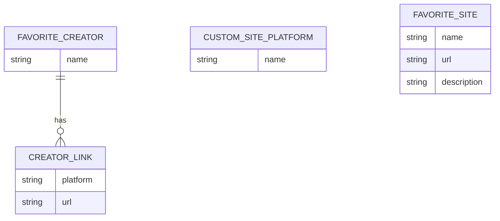
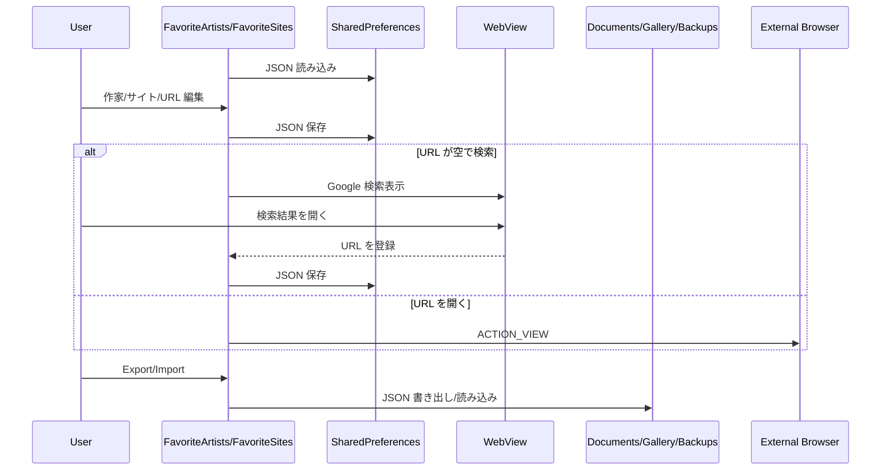

# お気に入り作家・サイト 詳細設計

## 1. 概要

お気に入り作家のリンク集と、お気に入りサイトのリンク集を管理する。Room ではなく SharedPreferences と JSON バックアップを使う軽量機能である。

## 2. お客さん目線の説明

よく見る作家さんやサイトをアプリ内にまとめられます。X、pixiv、支援サイトなどのリンクを作家ごとに持てます。URL が分からない場合は Google 検索を開いて、見つけたページを登録できます。

## 3. エンジニア目線の説明

`FavoriteArtistsScreen` と `FavoriteSitesScreen` は Compose state と SharedPreferences の JSON 文字列でデータを保持する。バックアップは `Documents/Gallery/Backups` に JSON として export/import する。URL 起動は `ACTION_VIEW`。

## 4. 画面設計

| 画面 | 内容 |
| --- | --- |
| `FavoriteArtistsScreen` | Creator tab 一覧、リンク編集、カスタムサイト、検索、import/export |
| `FavoriteSitesScreen` | サイトカード一覧、サイト編集、検索、import/export |
| WebView Dialog | Google 検索から URL を拾う |

## 5. 関連 DB

Room DB は使わない。

| 保存先 | 用途 |
| --- | --- |
| SharedPreferences `favorite_artists` | 作家名、プラットフォーム、URL、カスタムサイト |
| SharedPreferences `favorite_sites_prefs` | サイト名、URL、説明 |
| `Documents/Gallery/Backups/favorite_artists.json` | 作家リンクのバックアップ |
| `Documents/Gallery/Backups/favorite_sites.json` | サイトリンクのバックアップ |

## 6. ER 図

## 7. DAO / Repository

DAO / Repository は存在しない。画面内の private 関数が永続化を担う。

| 実装 | 役割 |
| --- | --- |
| `loadCreators()` / `saveCreators()` | 作家リンクの読み書き |
| `loadCustomSites()` / `saveCustomSites()` | プラットフォーム候補の読み書き |
| `loadFavoriteSites()` / `saveFavoriteSites()` | サイト一覧の読み書き |
| `exportData()` / `importData()` | JSON バックアップ |
| `CreatorSearchDialog` / `FavoriteSiteSearchDialog` | Google 検索から URL 選択 |

## 8. シーケンス図

## 9. 補足

- Room を使わないため、データ構造変更時は JSON 互換性に注意する。
- import は既存 URL や作家名との重複を避けて追加する。
- カスタムサイトは作家リンクのプラットフォーム候補としても使われる。
