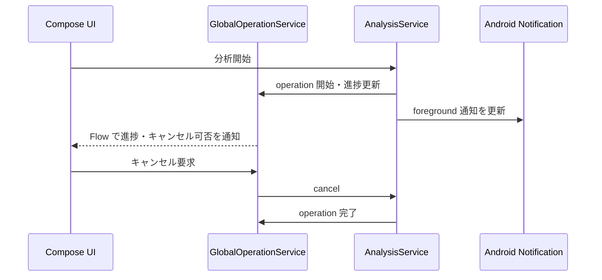

# 共通基盤 詳細設計

## 1. 概要

画面横断の状態、データベース、画像ローダー、テーマ、長時間処理の進捗とキャンセルを扱う基盤である。更新・バックアップの画面仕様は [設定・バックアップ・更新](11_settings_backup_update.md) を参照する。

## 2. 構成

| 層 | 実装 | 役割 |
| --- | --- | --- |
| Application | `GalleryApplication` | Conscrypt、Coil、`GalleryState`、クラッシュレポート初期化 |
| 状態 | `GalleryState` | フィルタ、表示設定、Repository、AI サービスへの共通入口 |
| DB | `GalleryDatabase` | Room database version 19、Migration 15→16 / 16→17 / 18→19 |
| 進捗 | `GlobalOperationService` | operation ID、進捗、キャンセル要求の集約 |
| UI | `GlobalProgressOverlay` | 実行中操作を現在画面へ重畳表示 |
| AI | `AnalysisService` | foreground service によるモデル確認と分析実行 |
| Theme | `GalleryTheme` / `GalleryThemeTokens` | カスタムパレットと Material3 色の統一 |

## 3. データベース

`GalleryDatabase` は `media_metadata`、`media_tags`、フォルダ管理、ダウンロード履歴、計測用データ、参照資料の Entity を登録する。通常のマイグレーションを適用できない既存 DB は `fallbackToDestructiveMigration(dropAllTables = true)` により再作成されるため、利用者向け設定・リンクは JSON バックアップを案内する。

## 4. 共通進捗

## 5. テーマと共通 UI

- `GalleryTheme` はテーマモード、カスタムパレット、文字サイズを Compose へ供給する。
- `ensureReadableTextColors()` と `buildGalleryColorScheme()` は背景と文字のコントラストを補正し、Material3 のメニュー、ダイアログ、ボタンに同じ配色を適用する。
- Drawer、BottomBar、チュートリアル、進捗オーバーレイは各画面のナビゲーション状態に応じて表示を切り替える。

## 6. 外部連携

| 連携 | 用途 |
| --- | --- |
| Room | ローカル状態の永続化 |
| Coil | 画像、GIF、動画フレームのキャッシュと表示 |
| Conscrypt | TLS 互換性補強 |
| Android Notification | AI 分析の foreground 通知、更新通知 |
| Kotlin Coroutines / Flow | 非同期処理、状態購読、キャンセル |
