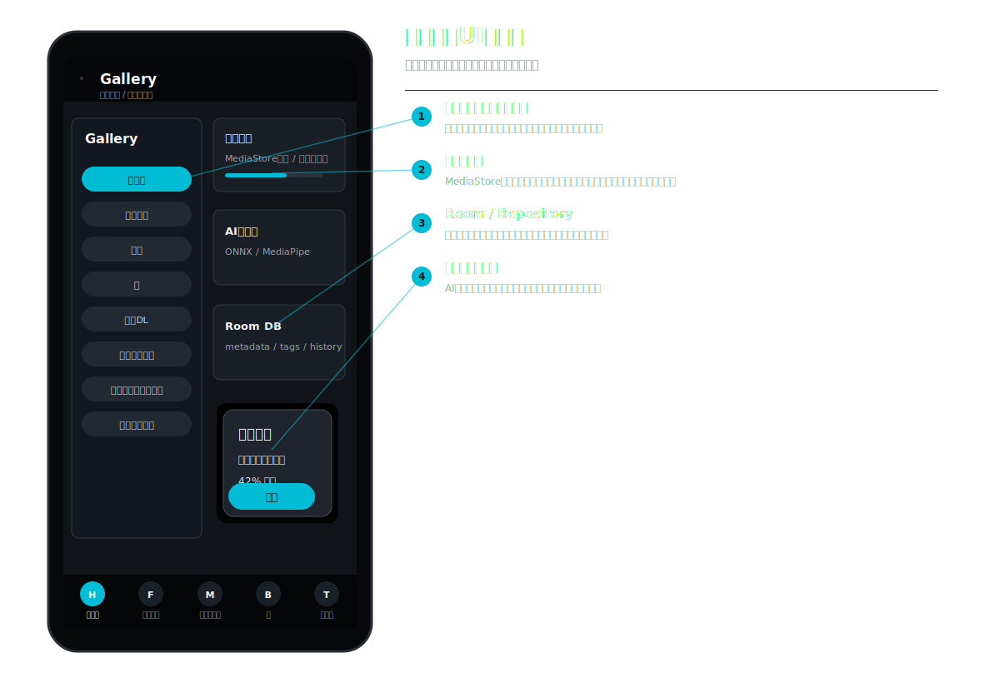
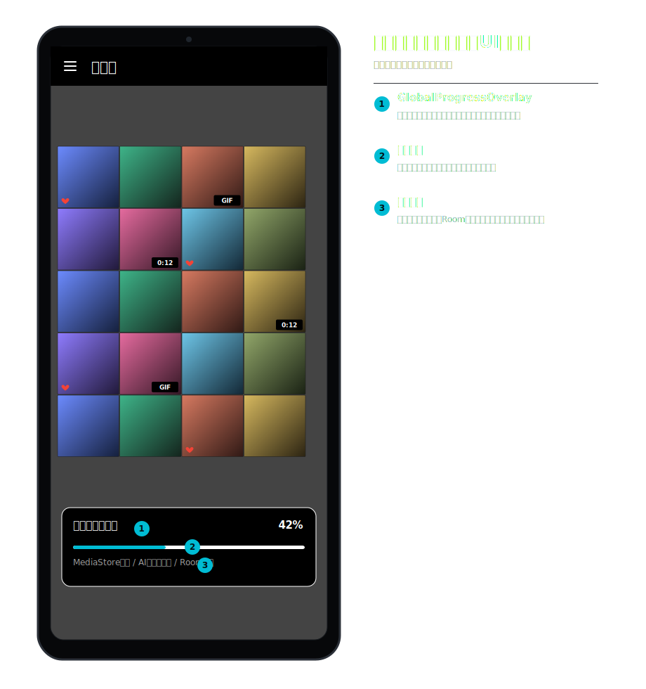
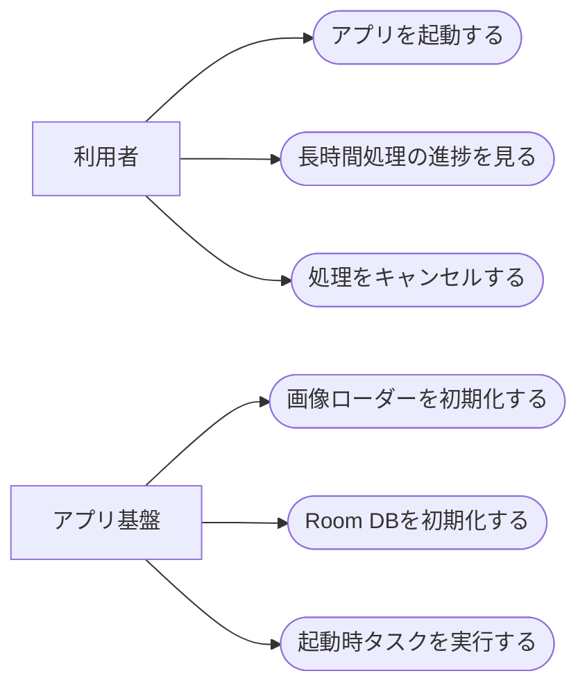
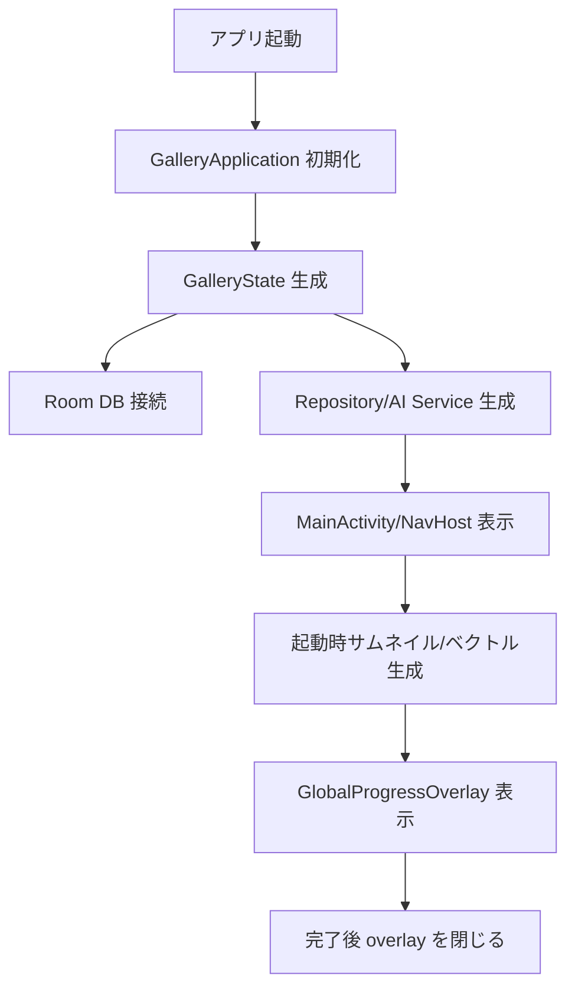
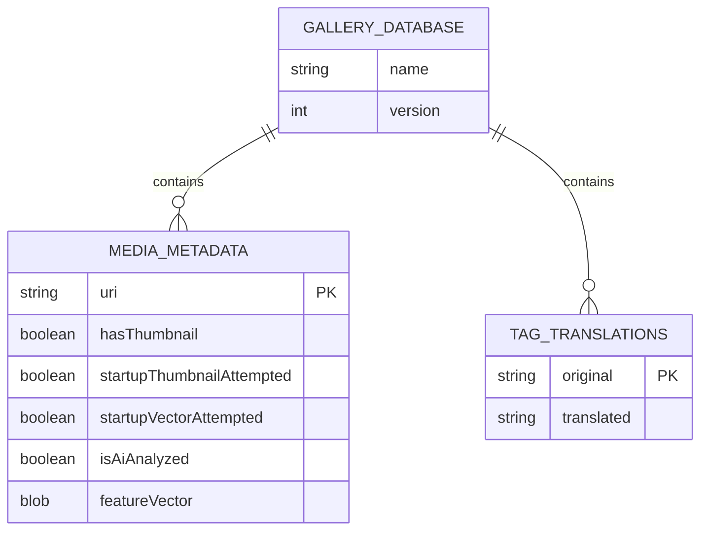
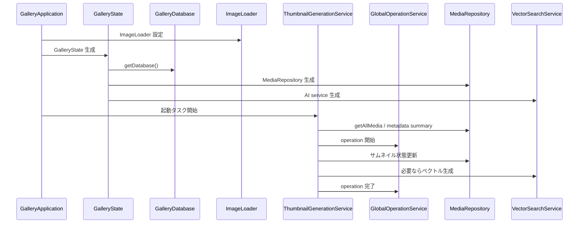

# 共通基盤・起動タスク 詳細設計

## 1. 概要

アプリ全体の状態、画像ローダー、Room DB、長時間処理、起動時タスク、モデル取得、タグ翻訳、通知・進捗を扱う共通基盤の設計。

## 2. 利用者向け機能説明

アプリを開くと、画像一覧が軽く動くようにキャッシュやサムネイルが準備されます。AI 分析のように時間がかかる処理は進捗が表示され、必要に応じてキャンセルできます。

## 3. 開発者向け技術説明

`GalleryApplication` が Coil と `GalleryState` を初期化する。`GalleryState` は `MediaRepository`, `AiTaggingService`, `VectorSearchService` を保持する。長時間処理は `AnalysisService`, `ThumbnailGenerationService`, `GlobalOperationService` に分け、UI は Flow / Compose state で購読する。

## 4. 画面設計

### 4.1. 画面の説明

共通基盤の画面要素は、単独の機能画面というより、アプリ全体に重なる補助 UI である。`GlobalProgressOverlay` は、AI 分析や起動時サムネイル生成など時間のかかる処理が動いていることを、現在の画面の上に表示する。

`AnalysisProgressScreen` は AI 分析専用の進捗画面で、ユーザーが処理の種類、対象期間、進捗、キャンセル可否を確認するために使う。Drawer と BottomBar は主要機能へ移動する入口であり、各機能画面の状態に応じて表示/非表示を切り替える。

### 4.2. 画面要素

| 部品 | 内容 |
| --- | --- |
| `GlobalProgressOverlay` | 全体進捗の表示 |
| `AnalysisProgressScreen` | AI 分析の進捗・キャンセル |
| `TutorialDialog` | 初回チュートリアル |
| Drawer / BottomBar | 主要機能への導線 |

### 4.3. UIモック

#### ナビゲーションドロワー

#### グローバル進捗オーバーレイ

| 番号 | UI部品 | 機能 |
| --- | --- | --- |
| 1 | Drawer | 主要機能、ガイド、補助画面への入口を提供する。 |
| 2 | ドロワー項目 | 実装ラベルとアイコンでホーム、フォルダ、タグ、本、ゴミ箱、動画DLなどへ遷移する。 |
| 3 | GlobalProgressOverlay | 起動時タスク、サムネイル生成、AI分析などの進捗を現在画面の上に表示する。 |
| 4 | 共通状態 | `GalleryState`、Room、Repository、サービス処理が各画面の状態を支える。 |

### 4.4. ユースケース図

### 4.5. 画面/操作フロー

## 5. 関連 DB

| テーブル | 用途 |
| --- | --- |
| `media_metadata` | サムネイル状態、ベクトル状態、AI 状態 |
| `tag_translations` | タグ翻訳 |
| すべての Room Entity | `GalleryDatabase` に登録 |

## 6. ER 図

## 7. DAO / Service

| 種別 | 実装 | 役割 |
| --- | --- | --- |
| Application | `GalleryApplication` | Conscrypt、Coil、GalleryState、クラッシュレポート |
| State | `GalleryState` | フィルタ、ナビ、Repository、AI サービス保持 |
| DB | `GalleryDatabase` | Room database version 18 |
| Service | `GlobalOperationService` | 進捗、キャンセル、operation ID 管理 |
| Service | `ThumbnailGenerationService` | 起動時サムネイル・ベクトル生成 |
| Service | `AnalysisService` | foreground AI 分析 |
| Utility | `ModelDownloader` | AI モデルとタグ CSV の取得・検証 |
| Utility | `TagTranslationService` | タグ翻訳・手動 override |

## 8. シーケンス図

## 9. 補足

- Coil は `limitedParallelism(2)` とキャッシュを使い、一覧スクロールの詰まりを抑える。
- `fallbackToDestructiveMigration(dropAllTables = true)` が設定されているため、DB 破壊的更新の扱いには注意する。
- `GalleryState` は便利な集約点だが、責務が増えやすいため新機能追加時は Repository / Service 側に処理を寄せる。

## 10. 利用 API・外部連携

| API / ライブラリ | 用途 |
| --- | --- |
| Room | `gallery_database` の生成・DAO 提供 |
| Coil | 全体 ImageLoader、メモリ/ディスクキャッシュ |
| Conscrypt | TLS 互換性補強 |
| Android Foreground Service | AI 分析の長時間実行 |
| Android Notification | 分析進捗表示 |
| OkHttp | モデル取得、外部通信 |
| Kotlin Coroutines / Flow | 非同期処理、進捗通知、状態購読 |
