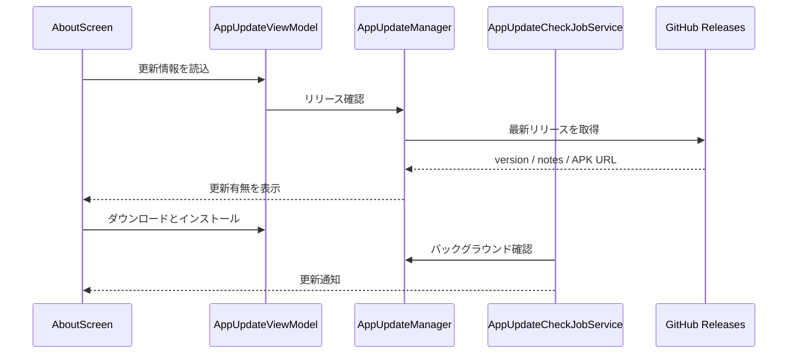

# 設定・バックアップ・更新 詳細設計

## 1. 概要

`AppSettingsScreen` はアプリ全体、テーマ、メディアビューア、動画ビューア、本ビューアの設定を提供する。`AboutScreen` はアプリバージョン、更新情報、更新 APK のダウンロード／インストール、変更履歴を表示する。

## 2. 設定

| 画面／分類 | 主な内容 |
| --- | --- |
| 全体設定 | 表示、AI、テーマ、各種操作、チュートリアル、バックアップ |
| テーマ | システム／ライト／ダーク、プリセット、カスタム配色、文字サイズ |
| メディアビューア | 情報表示、フレームバー、関連候補、上スワイプ、ズーム、ボトムバー配置 |
| 動画ビューア | シーク、ジェスチャ、表示ストリップ、ボトムバー配置 |
| 本ビューア | 見開き、右開き／左開き、表示品質、ページ操作 |

設定値は主に SharedPreferences に保存し、実行中のテーマ設定は読み込み直後に `applyRuntimeSettings()` で適用する。

## 3. バックアップ

`GalleryBackupManager` が JSON を作成・読込する。Storage Access Framework の `CreateDocument` / `OpenDocument` を用いるため、利用者が保存先・読込元を選択する。

| 操作 | 実装 |
| --- | --- |
| 全設定エクスポート | `exportAllToUri()` |
| 設定インポート | `importSettingsFromUri()` |
| 作家・サイトの読込 | `importFavoriteArtistsFromFile()` / `importFavoriteSitesFromFile()` |
| 失敗時 | Toast にエラーを表示し、実行中設定は成功時だけ再読込する。 |

## 4. 更新確認

- `AppUpdateManager` はリリースのバージョンを正規化して現在の `BuildConfig.VERSION_NAME` と比較する。
- `AppUpdateCheckJobService` は更新があり、未通知の版だけ通知を出す。
- APK の導入には `REQUEST_INSTALL_PACKAGES` と FileProvider を利用する。
