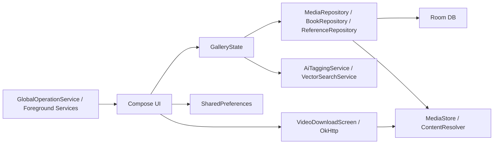

# Gallery 基本設計書

最終更新: 2026-07-12
対象バージョン: 0.6.0

## 1. 目的

Gallery は、端末内の画像、GIF、動画、ZIP/PDF形式の本を一つのアプリで閲覧・検索・整理するAndroidアプリである。大量メディアでも操作を止めず、AI分析、フォルダ整理、閲覧履歴、X投稿の保存までを端末中心で完結させる。

## 2. 対象範囲

- MediaStore上の画像、GIF、動画の一覧・閲覧・編集
- Roomに保存するタグ、年齢区分、特徴ベクトル、削除状態、履歴
- フォルダ一覧、表示グループ、メディア移動、ゴミ箱
- ZIP/PDFの本棚とブックビューア
- AIタグ分析、特徴ベクトル生成、類似画像表示
- X / Twitter投稿の動画・GIF一括保存
- お気に入りクリエイター、サイト、イラスト参考資料プロジェクト
- 設定、テーマ、バックアップ、チュートリアル、共通進捗

## 3. システム構成

| 層 | 主な実装 | 責務 |
| --- | --- | --- |
| UI | `MainActivity`, `GalleryGridView`, 各`Screen` | 表示、入力、ナビゲーション |
| 状態 | `GalleryState` | フィルタ、画面間状態、Repository参照 |
| データ | `MediaRepository`, `MediaDao`, `GalleryDatabase` | MediaStoreとRoomの同期、更新 |
| 長時間処理 | `AnalysisService`, `ThumbnailGenerationService`, `GlobalOperationService` | AI、サムネイル、進捗、キャンセル |
| 外部通信 | `VideoDownloadScreen`, `ModelDownloader`, OkHttp | X候補解決、メディア・モデル取得 |

## 4. 主要機能

### 4.1 メディア一覧

- `GalleryGridView` は2列で実画像比率のスタッガード表示、3列以上で均一セルを使用する。
- 2列から3・4列へ戻す際はレーン状態を再生成し、高さのずれを残さない。
- 日付順で隣接する画像の特徴ベクトルが60%以上一致した場合、件数上限なしで一つの類似グループに連鎖させる。
- 類似グループは現在のギャラリー表示順で並べ、タップすると4列・最大2段の吹き出しを開く。9件目以降は吹き出し内でスクロールする。
- 吹き出し内の画像を開く場合、ビューアに渡すリストは吹き出し内の画像だけに限定し、順番も吹き出し内と同じにする。
- 類似グループ表示は全体設定の「類似画像をグループ化」でON/OFFできる。OFF時はグループ計算を実行しない。
- 28列は年単位・最大6段の軽量表示とし、通常列より読み込み予算を抑える。

### 4.2 フォルダ管理

- `FolderGalleryScreen` がMediaStoreの保存先と管理対象フォルダを一覧化する。
- 複数フォルダを長押し選択し、名前付き表示グループを作成できる。
- フォルダグループは実フォルダを移動・統合せず、`global_settings` の表示定義として保存する。
- グループタイルは最大4フォルダの代表画像を表示する。タップすると吹き出し内に全フォルダを表示し、対象フォルダを開ける。
- グループ解除後は各フォルダを元の一覧へ戻す。

### 4.3 ビューア

- 画像/GIF/動画は`MediaViewerScreen`、動画専用全画面は`VideoFullscreenViewerScreen`、本は`BookViewerScreen`で表示する。
- ビューアを閉じた際は表示していたURIを一覧へ返し、スクロール位置を復元する。
- メディアビューア表示中はナビゲーションドロワーを開かない。

### 4.4 X / Twitterダウンロード

- `ACTION_SEND`, `ACTION_VIEW`, クリップボード、手入力、直接URLを受け付ける。
- fxtwitter / vxtwitter / fixupx / syndication APIのJSONから候補を抽出する。
- 同じメディアの画質違いは`mediaKey`でまとめ、各メディアから選択品質または最高ビットレートを1件だけ採用する。
- 投稿に動画・GIFが複数ある場合は、検出した全メディアを個別のファイル名・履歴IDで保存する。
- GIF由来MP4はGIF選択時のみ変換し、通常動画はMP4のまま保存する。

### 4.5 テーマと設定

- テーマは`GalleryColors`をCompositionLocalとMaterial3 `ColorScheme`へ同時に供給する。
- 背景と文字のコントラストが不足する場合は白または黒へ補正する。
- `surfaceContainer`などメニュー、ダイアログ、ボタンが内部利用する色もGalleryパレットへ割り当てる。
- 類似グループON/OFF、フォルダグループ定義は設定バックアップ対象の`global_settings`へ保存する。

## 5. データ設計

| 保存先 | 主なデータ |
| --- | --- |
| MediaStore | 画像、GIF、動画ファイルと保存先 |
| `media_metadata` | URI、日時、種別、サイズ、フォルダ、AI状態、特徴ベクトル、削除状態 |
| `media_tags` | URI別タグと信頼度 |
| `managed_folders` | 管理フォルダとカスタムサムネイル |
| `folder_order` | フォルダ表示順 |
| `video_downloads` | ダウンロードURL、保存先、状態、日時 |
| SharedPreferences | UI設定、テーマ、フォルダ表示グループ、検索履歴、ビューア設定 |

フォルダグループは表示上の設定であり、Roomの物理フォルダ関係は変更しない。類似画像グループは特徴ベクトルから都度導出し、グループ自体をDBへ保存しない。

## 6. エラー処理

- 権限不足、MediaStore更新失敗、外部API失敗はクラッシュさせず画面メッセージとログへ出す。
- 長時間処理は`GlobalOperationService`へ進捗を登録し、完了・失敗時に必ず終了する。
- Xの複数保存では1件ごとに履歴と進捗を分離し、一部失敗しても残りを継続する。
- 設定・フォルダグループの不正な保存値は既定値または空グループとして読み飛ばす。

## 7. 非機能要件

- 主要操作でANRを発生させない。ソート、ベクトル比較、ファイル処理はバックグラウンドで行う。
- 28列表示ではサムネイル要求数と描画コストを通常表示より制限する。
- 文字と背景は通常文字4.5:1、補助文字3:1を目安に補正する。
- 設定と表示グループはアプリ再起動・設定バックアップ後も復元できる。
- Android 12を基準端末の一つとし、API差があるMediaStore処理を分岐する。

## 8. 検証

- 自動テスト: `./gradlew.bat :app:testDebugUnitTest`
- コンパイル: `./gradlew.bat :app:compileDebugKotlin`
- 手動回帰: [回帰テスト計画](test/regression_test_plan.md)、[試験項目TSV](test/regression_test_cases.tsv)
- 詳細設計: [メディア一覧](detail_design/01_media_gallery.md)、[フォルダ](detail_design/04_folder_trash_bulk.md)、[Xダウンロード](detail_design/05_x_downloader.md)、[共通基盤](detail_design/10_shared_services.md)
