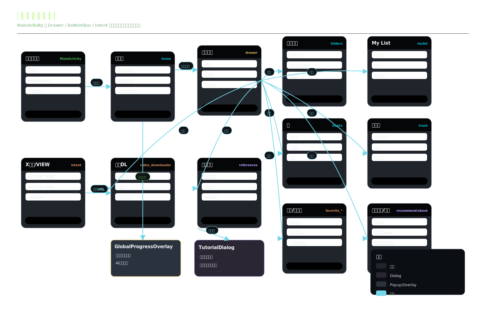
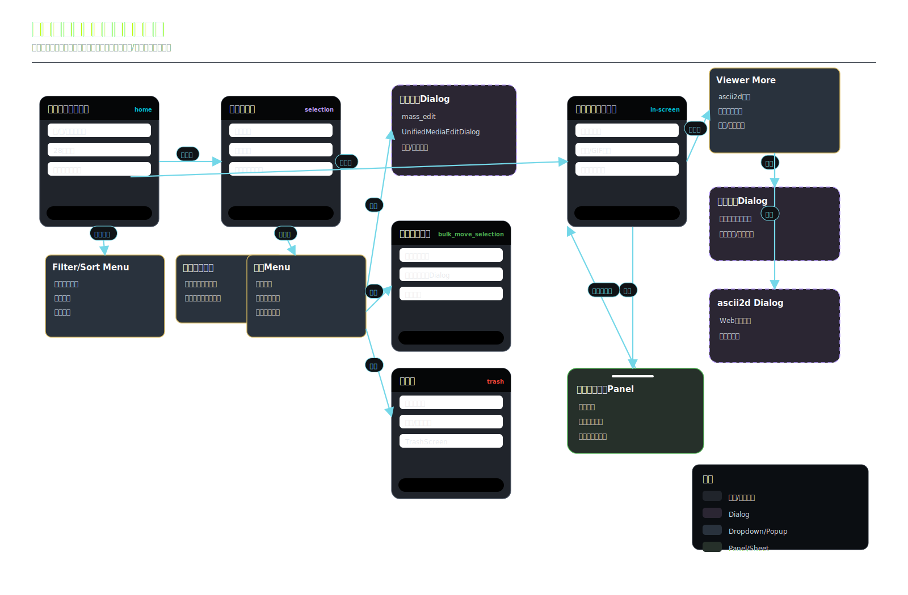
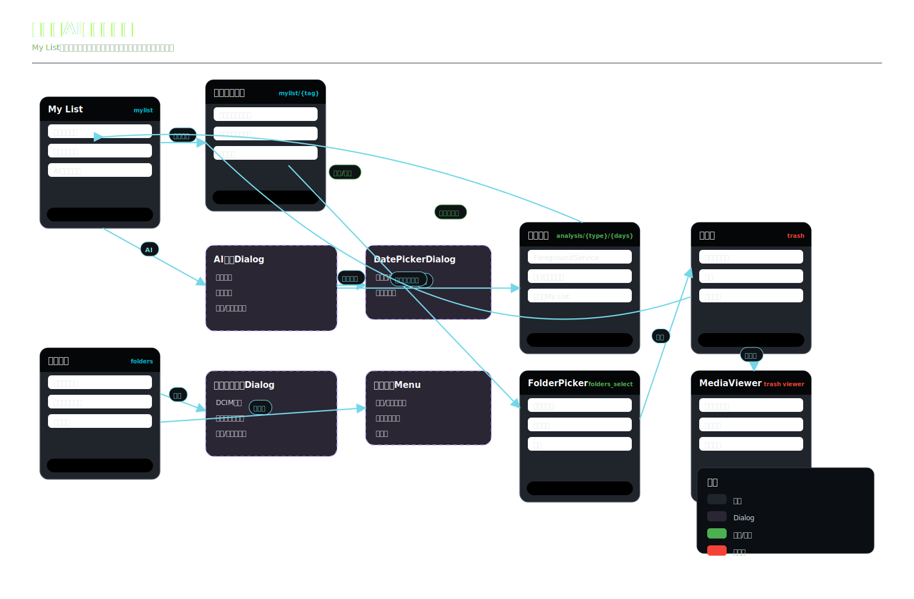
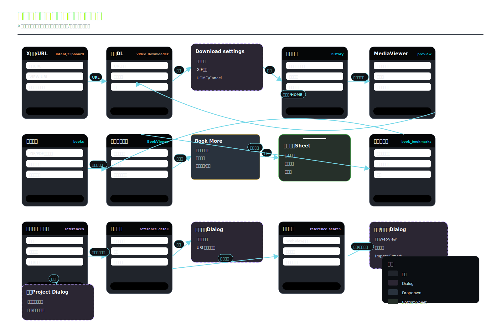

# Gallery 画面遷移図

## 1. 目的

Gallery の主要画面、画面内ビューア、ダイアログ、ポップアップ、ボトムシートの遷移関係を、簡単な UI モック付きで俯瞰できるようにする。

実装上の画面遷移は `MainActivity` の Navigation Compose を基準にし、画面内で表示される `AlertDialog`、`DropdownMenu`、`Popup`、`ModalBottomSheet` も図に含める。

## 2. 表現ルール

| 表現 | 意味 |
| --- | --- |
| 濃いカード | Navigation Compose の画面、または画面内の主要ビュー |
| 点線枠カード | `AlertDialog` / `Dialog` |
| 黄系カード | `DropdownMenu` / `Popup` |
| 緑系カード | `ModalBottomSheet` / 下部パネル |
| 矢印 | ユーザー操作または実装上の `navigate()` / 画面内状態変更 |

## 3. 全体画面遷移

アプリ起動、ドロワー、ボトムナビ、外部共有 Intent から主要画面へ入る流れを示す。

## 4. ギャラリー・ビューア遷移

ホームギャラリー、選択モード、フィルタ/ソート、スクロールバーラベル、メディアビューア、ビューア内メニュー、タグ編集、関連メディアパネルの流れを示す。

## 5. 整理・AI分析遷移

My List、カテゴリ一覧、AI 分析ダイアログ、日付選択、分析進捗、フォルダ作成、フォルダメニュー、フォルダ移動、ゴミ箱の流れを示す。

## 6. 外部連携・漫画・制作補助遷移

X / Twitter ダウンロード、保存設定、履歴プレビュー、漫画一覧/ビューア/表示設定、しおり、お絵描き資料、資料検索、お気に入り作家/サイトの補助ダイアログを示す。

## 7. 主な遷移ルート一覧

| 起点 | 遷移先 | 主な操作 |
| --- | --- | --- |
| `home` | `MediaViewerScreen` | メディアセルをタップ |
| `home` / `folders` | `mass_edit` | 選択モードから一括タグ・評価編集 |
| `home` / `folders` | `bulk_move_selection` | 選択モードからフォルダ移動 |
| `folders` | `analysis/AI_TAGGING` | フォルダ画面から分析開始 |
| `mylist` | `mylist/{tagName}` | タグカテゴリを選択 |
| `mylist` | `analysis/{type}/{periodDays}` | AI 分析ダイアログで開始 |
| `books` | `BookViewerScreen` | 漫画作品を開く |
| `book_bookmarks` | `books` | しおりから対象本へジャンプ |
| `references` | `reference_detail/{projectId}` | 資料プロジェクトを開く |
| `reference_detail/{projectId}` | `reference_search/{projectId}` | 資料追加で Web 検索へ遷移 |
| `video_downloader` | `MediaViewerScreen` | ダウンロード履歴のプレビューを開く |
| `favorite_artists` / `favorite_sites` | 検索 Dialog | 未入力 URL の検索補助を開く |
| `trash` | `MediaViewerScreen` | 削除済みメディアを確認 |

