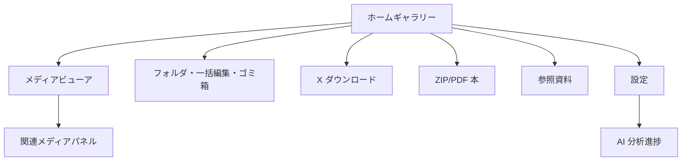
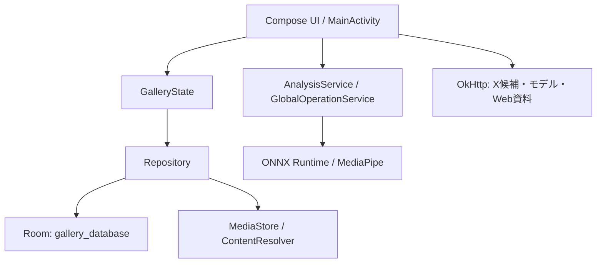
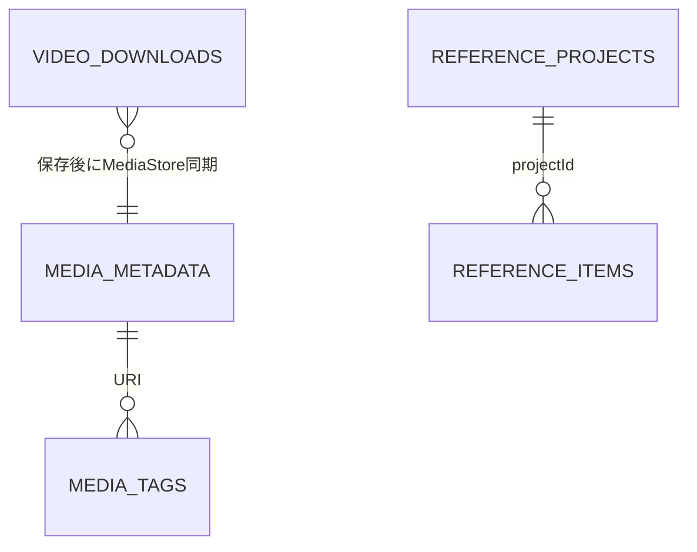

# Gallery 基本設計書

対象バージョン: 1.4.0
最終更新: 2026-07-22

## 1. 目的と対象範囲

Gallery は、Android 端末内の画像、GIF、動画、ZIP/PDF の本、および X の投稿から取得したメディアを扱う個人向けギャラリーアプリである。大量のメディアを軽く一覧し、閲覧、整理、AI 分析、ダウンロード、制作資料の収集を一つのアプリで完結させる。

対象は画像・GIF・動画・ZIP/PDF・参照資料である。関連候補はメディアビューア内のパネルとして提供する。

## 2. 利用者機能

| 分類 | 機能 |
| --- | --- |
| 一覧 | MediaStore の画像・GIF・動画を 2 / 3 / 4 / 7 / 28 列で表示。日付表示、検索、フィルタ、ソート、類似グループ、複数選択に対応。 |
| 一覧スクロール | 専用スクロールバーを長押し／ドラッグすると年月日を表示する。最下端へ離した場合は Staggered Grid の実際の下端まで移動し、バー下端と一覧下端を一致させる。 |
| ビューア | 画像／GIF のズームと操作、動画再生・シーク・フレーム保存、タグ・お気に入り・削除・壁紙設定を提供。 |
| 関連候補 | ビューア内で、画像の特徴ベクトルによる視覚類似候補と、年齢区分に応じたランダム候補を表示する。 |
| AI 分析 | タグ付け、年齢区分、特徴ベクトル生成を foreground service で実行し、進捗とキャンセルを表示する。 |
| 整理 | フォルダ管理、フォルダグループ、フォルダ移動、アプリ内ゴミ箱、復元、完全削除、一括編集を提供。 |
| X ダウンロード | 共有、ディープリンク、貼り付け、直接 URL から候補を解決し、画像・動画・GIF を保存する。 |
| 本／資料 | ZIP/PDF 本の閲覧としおり、制作資料プロジェクトの収集・参照・完了整理を提供。 |
| 設定 | テーマ、ビューア／動画／本の操作、バックアップ、アプリ情報、更新確認を提供。 |

## 3. 画面・遷移設計

### 3.1 ルート

| ルート | 主な画面／用途 |
| --- | --- |
| `home` | 全メディアのホームギャラリー |
| `folders` / `folders_select` | フォルダ一覧、フォルダ選択 |
| `videos` | 動画専用一覧とプレビュー |
| `books` / `book_bookmarks` | 本棚、しおり |
| `trash` | ゴミ箱、復元、完全削除 |
| `references` / `reference_detail/{projectId}` / `reference_search/{projectId}` | 参照資料プロジェクト |
| `video_downloader` | X ダウンロード |
| `favorite_artists` / `favorite_sites` | お気に入り作家・サイト |
| `settings` と各設定サブルート | 全体、ビューア、動画ビューア、本ビューア設定 |
| `search` / `about` | 検索、アプリ情報と更新 |
| `mass_edit` / `bulk_move_selection` | 一括編集、一括移動 |
| `analysis/{type}/{periodDays}` | AI 分析進捗 |

各画面の詳細な遷移は [画面遷移図](docs/画面遷移図.md) を正とする。

## 4. システム構成

- UI は Jetpack Compose と Navigation Compose で構成する。
- `GalleryState` は画面共通のフィルタ、表示設定、Repository、AI サービスへの入口を保持する。
- MediaStore の実ファイルと Room の補助メタデータを URI で対応付ける。
- 長時間の AI 分析は `AnalysisService` を foreground service として実行し、`GlobalOperationService` が進捗とキャンセルを集約する。

## 5. データ設計

`GalleryDatabase` は version 19。登録 Entity は以下のとおりである。

| Entity / テーブル | 用途 |
| --- | --- |
| `MediaMetadataEntity` / `media_metadata` | お気に入り、年齢区分、削除状態、AI 状態、サムネイル、特徴ベクトル |
| `TagEntity` / `media_tags` | AI／手動タグと信頼度 |
| `FolderOrderEntity` / `folder_order` | フォルダおよびグループの表示順 |
| `ManagedFolderEntity` / `managed_folders` | 管理フォルダと代表サムネイル |
| `TagTranslationEntity` / `tag_translations` | タグ翻訳・上書き |
| `VideoDownloadEntity` / `video_downloads` | X ダウンロードの URL、保存先、日時、状態 |
| `MeasureStatsEntity` / `measure_stats` | 計測用の保存領域。現行版には一覧表示する履歴画面はない。 |
| `ReferenceProjectEntity` / `reference_projects` | 制作資料プロジェクト |
| `ReferenceItemEntity` / `reference_items` | プロジェクト内のローカル／リモート資料 |

## 6. 主要処理

### 6.1 メディア一覧

`MediaRepository` が MediaStore を走査し、Room の軽量メタデータを結合して `MediaData` を生成する。`GalleryGridView` は `LazyVerticalStaggeredGrid` を用い、通常表示と 28 列の高密度表示を切り替える。最下端指定時は最終インデックス表示後に実スクロール可能範囲まで移動し、レーン長の差による終端ずれを防ぐ。

### 6.2 AI 分析

分析開始時に期間と種別を指定して `analysis/{type}/{periodDays}` へ遷移する。`AnalysisProgressScreen` が `AnalysisService` を開始し、モデル確認・ダウンロード、対象抽出、推論、Room 更新を実行する。通知とグローバル進捗からキャンセルできる。

### 6.3 X ダウンロード

`ACTION_SEND`、X/Twitter の `ACTION_VIEW`、貼り付け、手入力を受ける。投稿 URL は複数の候補 API で解決し、同一メディアの品質違いを一つに集約する。投稿内に動画候補がある場合、その投稿サムネイルの静止画 URL は保存候補に含めない。MediaStore には `IS_PENDING` を用いて保存し、作成日時・更新日時・撮影日時はダウンロード日時に統一する。

### 6.4 設定・更新

設定は SharedPreferences を中心に保持し、`GalleryBackupManager` が JSON の書き出し／読み込みを担当する。`AboutScreen` と `AppUpdateManager` は GitHub Releases の更新情報を確認し、必要に応じてダウンロードとインストール通知を扱う。

## 7. 非機能・安全設計

| 観点 | 設計 |
| --- | --- |
| 性能 | Paging、Coil キャッシュ、28 列専用の軽量描画、バックグラウンド処理を使用する。 |
| 破壊的操作 | 通常削除はゴミ箱へ移し、完全削除は明示操作として分ける。 |
| 保存の整合性 | MediaStore 書き込みは `IS_PENDING` を利用し、失敗時は履歴を FAILED として残す。 |
| 権限 | 画像・動画読取、旧 Android の外部ストレージ、全ファイルアクセス、通知、foreground service、インターネット、壁紙、更新 APK のインストールを用途に応じて要求する。 |
| 外部依存 | X 候補 API、AI モデル配布、WebView の内容は変更・失敗し得るため、失敗を UI へ返す。 |

## 8. テスト方針

- 既存の回帰観点と実施欄: [リグレッションテスト項目](docs/test/regression_test_cases.tsv)
- 今回の未追加回帰観点を含む運用方法: [リグレッションテスト計画](docs/test/regression_test_plan.md)
- 未実装の自動試験と導入順: [自動テスト追加バックログ](docs/test/automated_test_backlog.md)

## 9. 関連詳細設計

1. [メディア一覧](docs/detail_design/01_media_gallery.md)
2. [メディアビューア](docs/detail_design/02_media_viewer.md)
3. [AI 分析](docs/detail_design/03_ai_analysis.md)
4. [フォルダ・ゴミ箱・一括編集](docs/detail_design/04_folder_trash_bulk.md)
5. [X ダウンロード](docs/detail_design/05_x_downloader.md)
6. [本ビューア](docs/detail_design/06_book_viewer.md)
7. [参照資料プロジェクト](docs/detail_design/07_reference_projects.md)
8. [関連メディアパネル](docs/detail_design/08_related_media.md)
9. [お気に入り作家・サイト](docs/detail_design/09_favorite_creators_sites.md)
10. [共通基盤](docs/detail_design/10_shared_services.md)
11. [設定・バックアップ・更新](docs/detail_design/11_settings_backup_update.md)
