# Gallery 基本設計書

## 1. 目的

Gallery は、Android 端末内の画像、GIF、動画、ZIP/PDF 漫画ファイル、および X / Twitter 由来メディアを横断的に閲覧・分類・分析・管理する個人向けギャラリーアプリである。

標準ギャラリーでは不足しやすい大量メディアの高速一覧、AI タグ付け、年齢制限判定、画像ベクトル分析、関連メディア推薦、フォルダ管理、削除管理、視聴履歴、漫画ビューア、X / Twitter ダウンロードを 1 つのアプリ内で扱う。

## 2. 対象範囲

### 2.1. 対象メディア

| 種別 | 主な入力元 | 主な扱い |
| --- | --- | --- |
| 画像 | MediaStore / ContentResolver | 一覧、ビューア、タグ、AI 分析、壁紙、フォルダ管理 |
| GIF | MediaStore / ContentResolver / X ダウンロード | 一覧、再生、フレーム抽出、GIF 保存 |
| 動画 | MediaStore / ContentResolver / X ダウンロード | 一覧、ExoPlayer 再生、フレーム保存、シーク |
| ZIP 漫画 | 端末ストレージ | ページ単位閲覧、サムネイル、しおり |
| PDF 漫画 | 端末ストレージ | ページ単位閲覧、サムネイル、しおり |
| お絵描き資料 | URL / ローカルパス / WebView スクリーンショット | イラスト制作中に一時参照する資料プロジェクト管理、ローカル保存、完了時整理 |

### 2.2. 主な利用シーン

- 端末内の大量メディアを日・月・年・ストレージ単位で俯瞰する。
- 列数を 1 / 3 / 4 / 7 / 28 に切り替えて閲覧密度を変える。
- 28 列表示では軽量セルと表示件数抑制によりスクロール応答性を優先する。
- AI でタグ、年齢制限、画像ベクトルを分析する。
- お気に入り、未整理、未分析、タグカテゴリなどから My List を作る。
- 画像、GIF、動画を全画面ビューアで閲覧し、ズーム、スワイプ、壁紙設定、フレーム保存を行う。
- 不要メディアをアプリ内ゴミ箱へ移し、復元または完全削除する。
- フォルダ単位で整理し、フォルダ順序やサムネイルを管理する。
- ZIP / PDF 漫画をページ単位で読む。
- X / Twitter の共有 URL、VIEW URL、クリップボード URL、直接メディア URL からメディアを保存する。
- イラスト制作中の資料をプロジェクト単位で一時収集し、描き終わったら整理する。
- 視聴履歴、タグ類似、ベクトル類似を使っておすすめを表示する。

### 2.3. ユースケース図

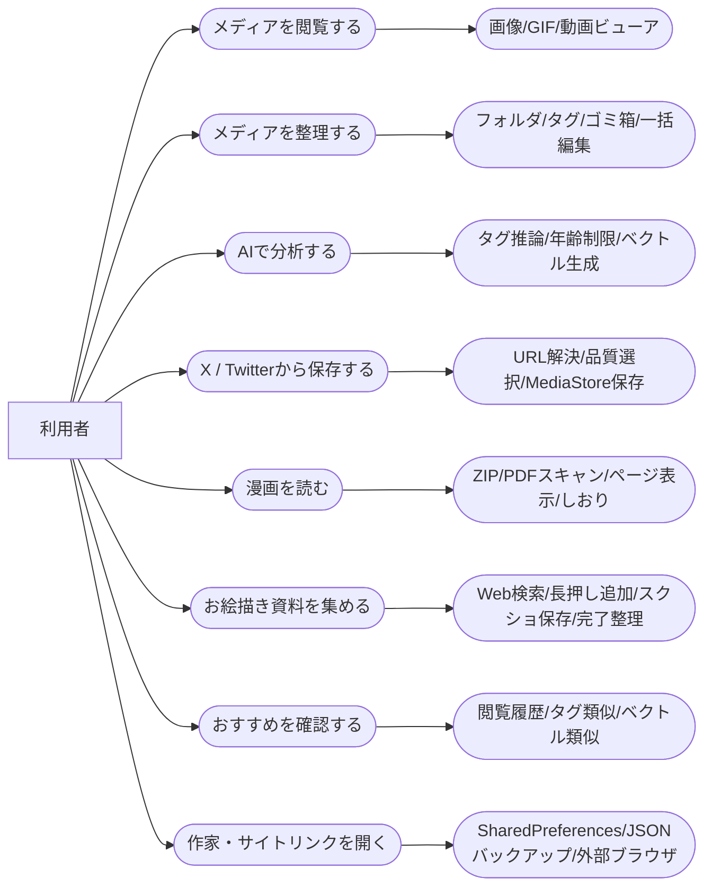

### 2.4. 全体利用フロー

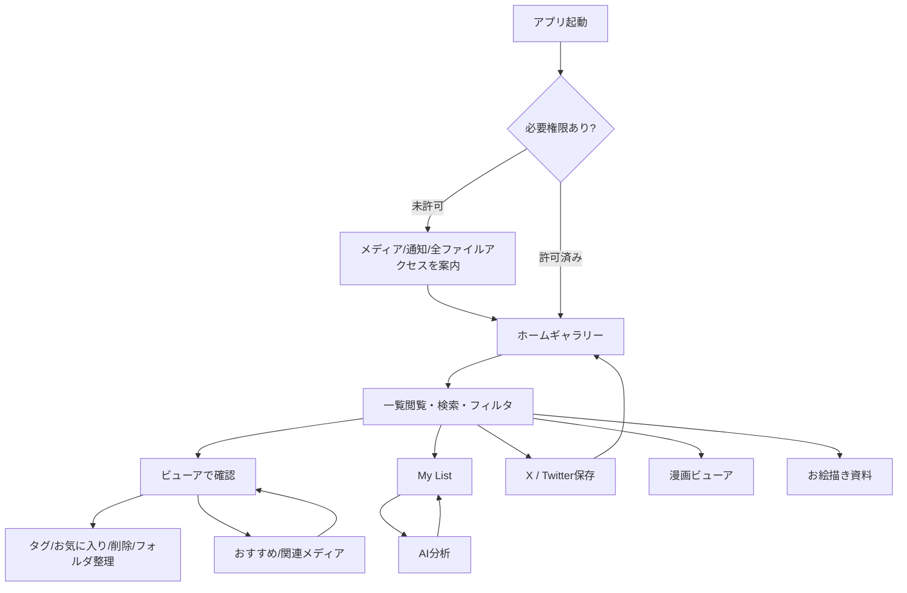

### 2.5. 画面遷移図

主要画面、画面内ビューア、ダイアログ、ポップアップ、ボトムシートの遷移は、各詳細設計書の「機能内画面遷移図」にまとめる。各図への入口は [画面遷移図](docs/画面遷移図.md) にまとめる。

## 3. システム構成

### 3.1. 全体アーキテクチャ

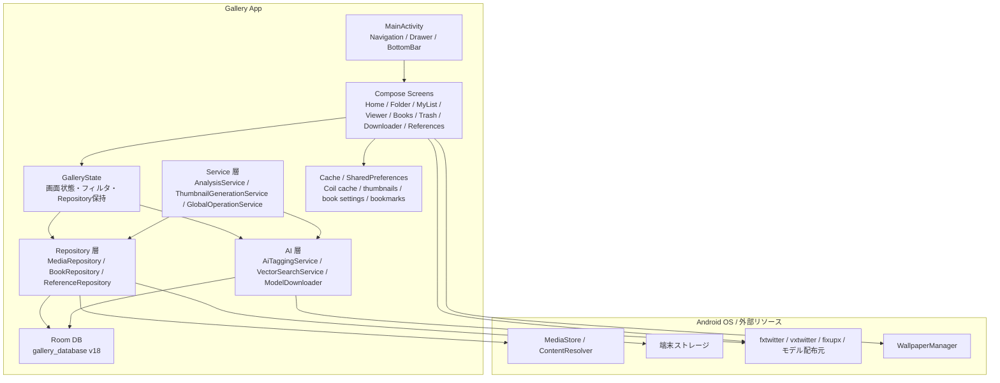

### 3.2. レイヤ責務

| レイヤ | 主な責務 | 主な実装 |
| --- | --- | --- |
| Application | Coil 設定、Conscrypt 追加、グローバル状態生成、クラッシュレポート起動 | `GalleryApplication` |
| Presentation | Compose UI、画面遷移、ユーザー操作受付 | `MainActivity`, `ui/screen/*`, `ui/component/*` |
| State | フィルタ、ソート、選択、戻り位置、サービス参照 | `ui/state/GalleryState.kt` |
| Repository | MediaStore / Room / ファイル操作の統合 | `MediaRepository`, `BookRepository`, `ReferenceRepository` |
| Local DB | メタデータ、タグ、分析結果、フォルダ、履歴、参照画像を永続化 | Room, `MediaDao`, `ReferenceDao` |
| Service | 長時間処理、進捗、キャンセル、バックグラウンド処理 | `AnalysisService`, `ThumbnailGenerationService`, `GlobalOperationService` |
| AI | ONNX タグ推論、MediaPipe ベクトル生成、モデル管理 | `AiTaggingService`, `VectorSearchService`, `ModelDownloader` |
| Utility | サムネイル、タグ翻訳、動画/GIF補助、ファイル補助 | `ThumbnailUtils`, `TagTranslationService` ほか |

## 4. 画面設計

### 4.1. 画面遷移

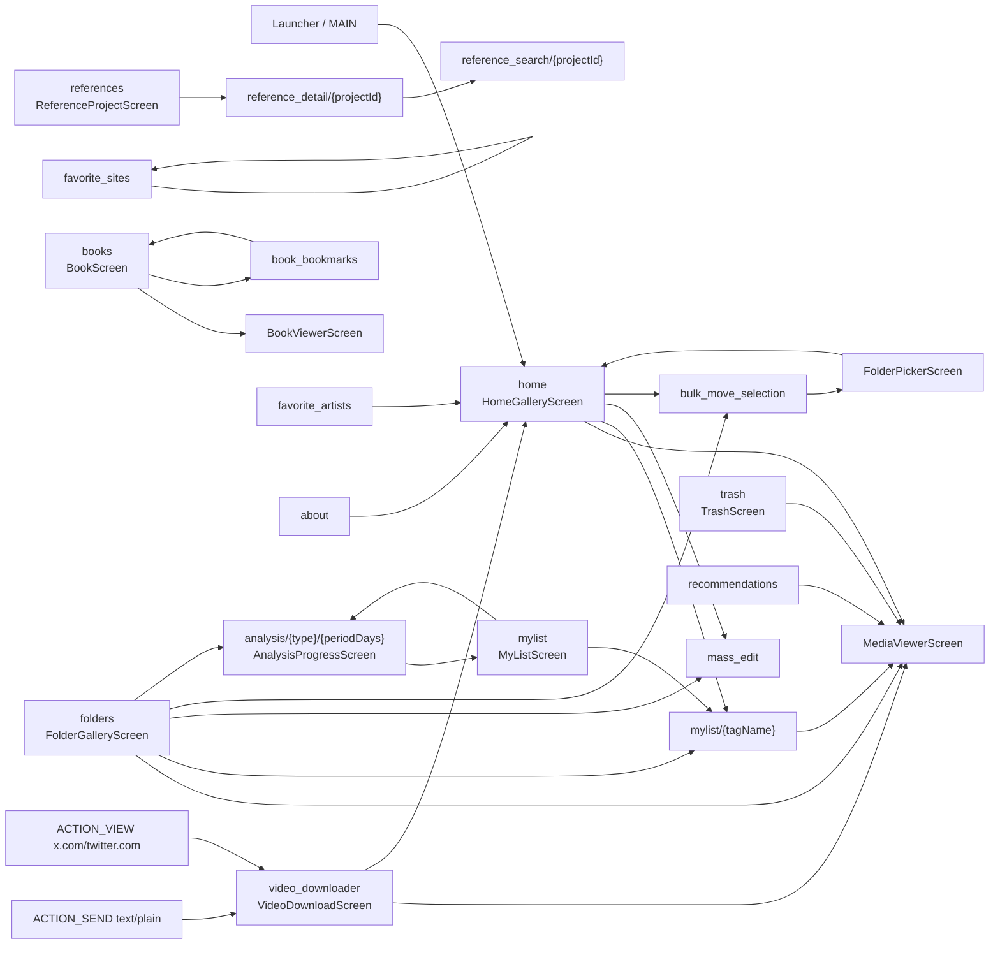

### 4.2. 主な画面

| 画面 | ルート | 概要 |
| --- | --- | --- |
| ホームギャラリー | `home` | 端末内メディア全体の一覧。ビューア、タグ遷移、一括編集、一括移動へ接続する。 |
| フォルダ | `folders` | 管理フォルダ、フォルダ内メディア、フォルダサムネイル、AI 分析開始を扱う。 |
| My List | `mylist`, `mylist/{tagName}` | お気に入り、未整理、AI 未分析、ベクトル未分析、タグカテゴリを表示する。 |
| 分析進捗 | `analysis/{type}/{periodDays}` | AI タグ、ベクトル、年齢制限分析の進捗とキャンセル導線を提供する。 |
| メディアビューア | 画面内コンポーネント | 画像/GIF/動画を共通ビューアで扱う。 |
| 漫画 | `books` | ZIP / PDF ファイルをスキャンし、漫画ビューアへ接続する。 |
| しおり | `book_bookmarks` | SharedPreferences の漫画しおり一覧を表示する。 |
| ゴミ箱 | `trash` | `isDeleted=true` のメディアを表示し、復元・完全削除を行う。 |
| お絵描き資料 | `references` | イラスト制作中に使う資料プロジェクトの一覧、詳細、検索追加、完了時整理を扱う。 |
| X ダウンローダ | `video_downloader` | 共有 URL、VIEW URL、クリップボード URL、直接 URL からメディア候補を解決し保存する。 |
| おすすめ | `recommendations` | 視聴履歴、タグ類似、ベクトル類似、ランダム候補からおすすめを表示する。 |

## 5. データ設計

### 5.1. Room Database

| 項目 | 内容 |
| --- | --- |
| DB 名 | `gallery_database` |
| Room version | `18` |
| DAO | `MediaDao`, `ReferenceDao` |
| Migration | `Migration15To16`, `Migration16To17` を登録。破壊的マイグレーションも許容。 |
| TypeConverter | `FloatArray` などを DB 保存用に変換する。 |

### 5.2. ER 図

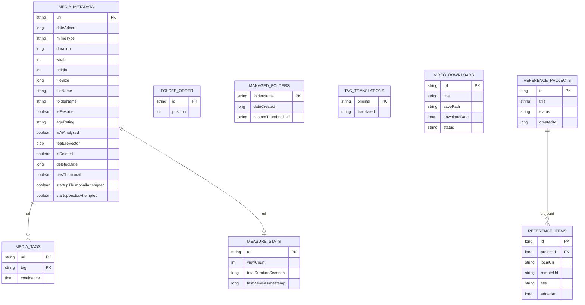

補足: `media_tags.uri` と `measure_stats.uri` は実装上 Room の外部キー制約を持たないが、論理的には `media_metadata.uri` に紐づく。`reference_items.projectId` は `reference_projects.id` への外部キーを持ち、プロジェクト削除時に CASCADE 削除される。

### 5.3. Entity 一覧

| Entity | テーブル | 主キー | 用途 |
| --- | --- | --- | --- |
| `MediaMetadataEntity` | `media_metadata` | `uri` | MediaStore メディアのメタデータ、AI 状態、削除状態、特徴ベクトル、サムネイル状態 |
| `TagEntity` | `media_tags` | `uri`, `tag` | メディアごとのタグと信頼度 |
| `FolderOrderEntity` | `folder_order` | `id` | フォルダまたはグループの表示順 |
| `ManagedFolderEntity` | `managed_folders` | `folderName` | 管理対象フォルダとカスタムサムネイル |
| `TagTranslationEntity` | `tag_translations` | `original` | タグ表示名の翻訳 |
| `VideoDownloadEntity` | `video_downloads` | `url` | X / Twitter ダウンロード履歴 |
| `MeasureStatsEntity` | `measure_stats` | `uri` | 閲覧回数、閲覧時間、最終閲覧日時 |
| `ReferenceProjectEntity` | `reference_projects` | `id` | 参照画像プロジェクト |
| `ReferenceItemEntity` | `reference_items` | `id` | プロジェクト内の参照画像 URL / ローカル URI |

### 5.4. 主な DAO 操作

| DAO | 主な操作 |
| --- | --- |
| `MediaDao` | メタデータ取得・登録・一括登録・削除、タグ登録・削除・集計、お気に入り更新、年齢制限更新、AI 分析結果保存、特徴ベクトル保存、サムネイル状態更新、ゴミ箱状態更新、視聴統計保存、フォルダ順序管理、管理フォルダ管理、ダウンロード履歴管理、フィルタ付き PagingSource 生成 |
| `ReferenceDao` | 参照プロジェクト CRUD、参照アイテム CRUD、プロジェクト内アイテム取得、ローカル URI クリア |

## 6. 機能設計

### 6.1. メディア一覧

- `MediaRepository` が MediaStore / ContentResolver から画像・動画を取得し、`MediaData` に変換する。
- 既存の Room メタデータと突き合わせ、追加・更新・削除を反映する。
- `GalleryGridView` が `LazyVerticalGrid` で表示する。
- 1 / 3 / 4 / 7 / 28 列表示に対応する。
- 28 列表示は高密度モードとして扱い、年単位グルーピング、軽量セル、サムネイル読み込み抑制、表示件数制限で応答性を優先する。
- メディア種別、年齢制限、端末向けアスペクト比、日付・サイズ・名前ソートを `GalleryState` と DAO クエリで管理する。

### 6.2. フィルタ・ソート・グルーピング

| 種別 | 値 |
| --- | --- |
| `GalleryViewMode` | `FOLDER`, `MYLIST`, `TRASH` |
| `GroupingMode` | `NONE`, `DAY`, `MONTH`, `YEAR`, `STORAGE` |
| `MediaTypeFilter` | `ALL`, `IMAGE`, `VIDEO`, `GIF` |
| `AgeRatingFilter` | `ALL`, `SFW`, `R15`, `R18` |
| `DeviceFilter` | `ALL`, `SMARTPHONE`, `PC` |
| `SortMode` | `DATE_ADDED`, `SIZE`, `NAME` |

### 6.3. メディアビューア

- 画像、GIF、動画を同一の `MediaViewerScreen` で扱う。
- `HorizontalPager` で前後メディアへ移動する。
- タップでシステムバー / アプリバー表示を切り替える。
- ダブルタップ、ピンチ、パンでズーム操作を行う。
- 下スワイプでビューアを閉じ、上スワイプでおすすめタブを開く。
- お気に入り、タグ編集、削除、復元、完全削除、壁紙設定、フォルダサムネイル設定を行う。
- 動画は Media3 ExoPlayer で再生し、再生 / 一時停止 / ミュート / シーク / フレーム送り / フレーム保存を扱う。
- GIF は Coil 表示とフレーム抽出を扱い、現在フレーム保存と壁紙設定に対応する。
- ビューアで最後に見た URI は `GalleryState.lastViewedUri` に保存し、ギャラリー復帰時の位置合わせに使う。

### 6.4. My List

- お気に入り、未整理、AI 未分析、ベクトル未分析、タグ別カテゴリを表示する。
- カテゴリを選択すると `CategoryScreen` により対象メディアを一覧表示する。
- AI 分析対象期間は 7 日、30 日、すべて、カスタム日数を扱う。
- タグカテゴリは件数と代表サムネイルを表示する。

### 6.5. フォルダ管理

- 端末内フォルダをスキャンし、管理対象フォルダとして登録する。
- `managed_folders` にフォルダ名、作成日、カスタムサムネイル URI を保存する。
- `folder_order` に表示順を保存する。
- DCIM 配下への新規フォルダ作成、フォルダ別表示、フォルダ移動、フォルダサムネイル設定に対応する。

### 6.6. ゴミ箱

- 通常削除では物理削除せず、`media_metadata.isDeleted=true` と `deletedDate` を更新する。
- ゴミ箱画面では削除済みメディアを `deletedDate` 降順で表示する。
- 復元は `isDeleted=false` に戻す。
- 完全削除は ContentResolver / MediaStore から削除し、Room のメタデータとタグも削除する。

### 6.7. AI 分析

- `AnalysisService` が foreground service として実行する。
- 分析種別は `AI_TAGGING`, `COLOR_VECTOR`, `AUTO_RATING` を想定する。
- モデル不足時は `ModelDownloader.downloadAllModels` を実行する。
- タグ推論は `AiTaggingService` が ONNX Runtime で実行する。
- ベクトル生成は `VectorSearchService` が MediaPipe Image Embedder で実行する。
- 対象は動画を除外し、未分析または未ベクトルのメディアを優先する。
- 端末の thermal status に応じてクールダウンし、過熱時は一時停止する。
- 進捗とキャンセルは `GlobalOperationService` と通知で管理する。

### 6.8. おすすめ

- `measure_stats` の閲覧回数・閲覧時間を使って上位閲覧メディアを抽出する。
- タグ類似、特徴ベクトル類似、ランダム候補を組み合わせて推薦候補を作る。
- 推薦画面からビューアを開いた場合、戻り時に対象メディアがギャラリー中央へ来るように扱う。

### 6.9. 漫画ビューア

- `BookRepository` が ZIP / PDF を端末ストレージからスキャンする。
- ZIP は `ZipFile` で画像エントリをページとして扱う。
- PDF は `PdfRenderer` でページ数とページ画像を取得する。
- 先頭ページからサムネイルを生成し、キャッシュインデックスに保存する。
- `BookViewerScreen` は単ページ / 見開き、右開き / 左開き、表示フィット、背景、描画品質、ページ間隔、プリロード、タップナビゲーション、画面常時点灯を設定できる。
- しおりは SharedPreferences `book_bookmarks` に保存する。
- 表示ページのスクリーンショット保存に対応する。

### 6.10. お絵描き資料参照プロジェクト

参照プロジェクトは、イラスト制作中に必要なポーズ、衣装、背景、小物、塗りなどの資料を一時フォルダへ集め、作業中にすぐ見返せるようにするお絵描き補助ツールである。恒久的な画像コレクションではなく、制作案件ごとに資料を束ねるワークスペースとして扱う。

- `ReferenceRepository` が Room と `Documents/Gallery/References/{projectId}` 配下の一時資料ファイルを管理する。
- `ReferenceProjectScreen` で制作単位のプロジェクトを作成・削除する。
- `ReferenceDetailScreen` でプロジェクト内の資料を 2 列グリッド表示し、タップで `MediaViewerScreen` による全画面参照を行う。
- `ReferenceSearchScreen` は WebView で画像検索を開き、画像長押しで資料 URL を追加できる。
- WebView 右上のスクリーンショット操作により、検索画面の見えている範囲を資料として保存できる。
- URL から追加した資料はローカル保存し、`reference_items.localUri` に保存先、`remoteUrl` に元 URL を保持する。
- まだローカル保存されていない資料は詳細画面から再ダウンロードできる。
- プロジェクトは `ACTIVE` / `FINISHED` ステータスを持つ。
- プロジェクト完了時は、スクリーンショットなど残すべき資料を除き、一時保存した参照画像を削除して `localUri` を `NULL` に戻し、必要に応じて URL 参照に切り替える。
- プロジェクト削除時はローカル参照フォルダも削除し、Room は `reference_items` を CASCADE 削除する。

### 6.11. X / Twitter ダウンロード

- `ACTION_SEND text/plain` と `ACTION_VIEW https://x.com/.../status/...`, `https://twitter.com/.../status/...` を受け取る。
- 共有 URL は `MainActivity` から `VideoDownloadScreen` の `initialUrl` として渡す。
- クリップボード URL、手入力 URL、直接メディア URL も扱う。
- status URL は `api.fxtwitter.com`, `api.vxtwitter.com`, `api.fixupx.com` の候補 API で解決する。
- `MediaUrlCandidate` に URL、品質、content-type、GIF 由来フラグを保持する。
- High / Medium / Low または GIF 専用候補を選択する。
- 保存先は動画が Movies/Gallery、画像/GIF が Pictures/Gallery。
- MediaStore に `IS_PENDING=1` で作成し、保存完了後に `IS_PENDING=0` へ更新する。
- GIF 由来の mp4 はフレーム抽出と GIF エンコードで GIF として保存できる。
- ダウンロード履歴は `video_downloads` に保存し、重複判定、履歴表示、履歴削除に使う。

## 7. 主要シーケンス

### 7.1. 起動からメディア一覧表示

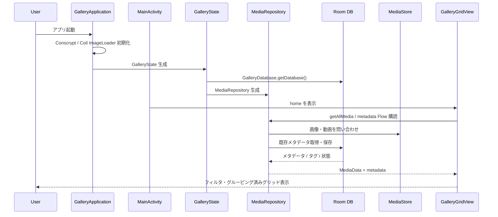

### 7.2. ビューア閲覧と戻り位置同期

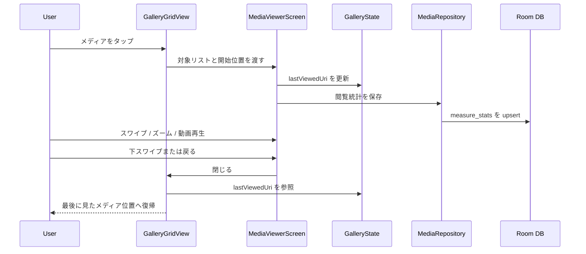

### 7.3. AI タグ分析

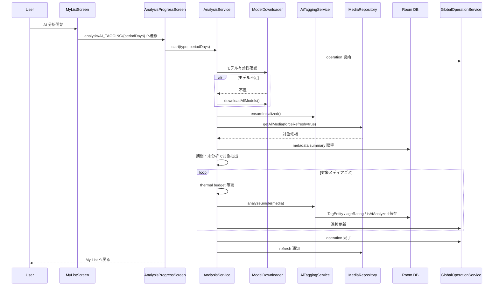

### 7.4. 起動時サムネイル・ベクトル生成

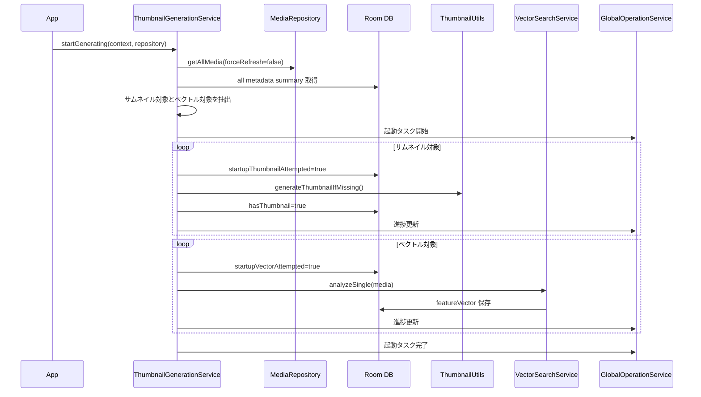

### 7.5. X / Twitter ダウンロード

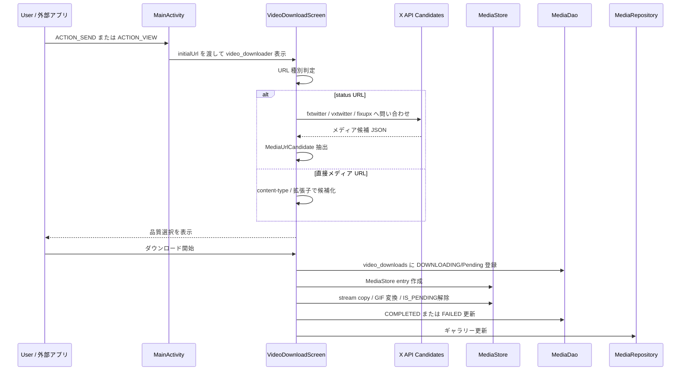

### 7.6. 漫画閲覧

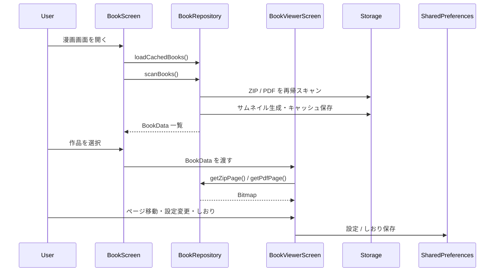

## 8. 非機能設計

### 8.1. 性能

- 一覧表示は `LazyVerticalGrid`, Paging, Flow を使い、大量メディアでも画面外アイテムの負荷を抑える。
- Coil はメモリキャッシュ 25%、ディスクキャッシュ 10%、`Dispatchers.IO.limitedParallelism(2)`, `RGB_565` を使う。
- AI 分析、サムネイル生成、重いファイル処理は UI スレッドで実行しない。
- 28 列表示では詳細サムネイルよりスクロール応答性を優先する。
- 年単位グルーピングでは各年の表示件数を抑制する。
- 起動時サムネイル / ベクトル生成は試行済みフラグを保存し、同一セッション内の重複処理を避ける。

### 8.2. 保守性

- 画面状態は `GalleryState` に集約する。
- DB 操作は DAO、メディア操作は Repository、長時間処理は Service に分離する。
- AI 処理は `AiTaggingService` と `VectorSearchService` に分離し、モデル取得は `ModelDownloader` に寄せる。
- 共通一覧表示は `GalleryGridView` / `CategoryScreen` を中心に再利用する。
- UI から直接 DB を触る箇所は限定し、基本的には Repository 経由とする。

### 8.3. 安全性

- 通常削除はアプリ内ゴミ箱へ移動し、完全削除と明確に分離する。
- MediaStore 書き込み時は Android バージョンに応じて `IS_PENDING` と `RELATIVE_PATH` を使う。
- X ダウンロードは m3u8 を直接保存対象から除外し、対応可能な直接メディア URL を優先する。
- GIF 由来メディアは `isGifSource` を保持し、保存時のメディア種別を維持する。
- モデルダウンロード失敗時は分析を中断し、ユーザーに通知する。
- foreground service と通知により長時間分析の状態を明示する。

### 8.4. 拡張性

- `GalleryState` の enum 追加により、フィルタ・ソート・グルーピング条件を拡張できる。
- `MediaRepository` の推薦ロジックは視聴履歴、タグ類似、ベクトル類似を組み合わせる構造のため、新しい候補ソースを追加しやすい。
- `ReferenceRepository` は URL 参照とローカル参照を同じ `ReferenceItemEntity` で扱うため、将来の参照元追加に対応しやすい。
- `ModelDownloader` にモデル取得を集約しており、AI モデル差し替え時の影響範囲を抑えられる。

## 9. 権限・Intent 設計

### 9.1. 権限

| 権限 | 用途 |
| --- | --- |
| `READ_MEDIA_IMAGES` | Android 13 以降の画像読み取り |
| `READ_MEDIA_VIDEO` | Android 13 以降の動画読み取り |
| `READ_EXTERNAL_STORAGE` | Android 12 以前の読み取り |
| `WRITE_EXTERNAL_STORAGE` | Android 9 以前の書き込み |
| `MANAGE_EXTERNAL_STORAGE` | ZIP / PDF 漫画など全ファイルスキャン |
| `INTERNET` | X API、画像参照、AI モデル取得 |
| `ACCESS_NETWORK_STATE` | 通信状態確認 |
| `SET_WALLPAPER` | 壁紙設定 |
| `FOREGROUND_SERVICE` | AI 分析などの foreground service |
| `FOREGROUND_SERVICE_DATA_SYNC` | Android 14 以降の dataSync foreground service |
| `POST_NOTIFICATIONS` | Android 13 以降の通知表示 |

### 9.2. Intent

| Intent | 条件 | 遷移先 |
| --- | --- | --- |
| `MAIN` / `LAUNCHER` | アプリ起動 | `home` |
| `ACTION_SEND` | `text/plain` | `video_downloader` |
| `ACTION_VIEW` | `https://x.com/*/status/*` | `video_downloader` |
| `ACTION_VIEW` | `https://twitter.com/*/status/*` | `video_downloader` |

`MainActivity` は `launchMode="singleTask"` で起動し、共有 URL / VIEW URL を既存タスクへ渡せるようにする。

## 10. API・外部連携設計

### 10.1. 外部 Web API / Web サービス

| 連携先 | 利用箇所 | 用途 | 備考 |
| --- | --- | --- | --- |
| `api.fxtwitter.com` | `VideoDownloadScreen` | X / Twitter status URL から動画・画像候補を取得 | JSON 構造変更の影響を受ける |
| `api.vxtwitter.com` | `VideoDownloadScreen` | X / Twitter 代替 API | fxtwitter のフォールバック候補 |
| `api.fixupx.com` | `VideoDownloadScreen` | X / Twitter 代替 API | fxtwitter / vxtwitter のフォールバック候補 |
| Google 画像検索 | `ReferenceSearchScreen` | お絵描き資料画像の検索 | WebView 表示。Google API ではなく通常 Web ページ利用 |
| Google 検索 | `FavoriteArtistsScreen`, `FavoriteSitesScreen` | 作家・サイト URL 検索補助 | WebView 表示。遷移先 URL を登録 |
| ascii2d | `MediaViewerScreen` | 画像検索/類似元検索の補助 | WebView とファイルアップロード補助で利用 |
| AI モデル配布元 | `ModelDownloader` | ONNX / MediaPipe モデルとタグ CSV の取得 | ネットワーク失敗時は分析を中断 |

### 10.2. Android Framework API

| API | 利用箇所 | 用途 |
| --- | --- | --- |
| `MediaStore` | `MediaRepository`, `VideoDownloadScreen`, `BookViewerScreen`, `MediaViewerScreen` | 端末メディア取得、保存、削除、スクリーンショット保存 |
| `ContentResolver` | `MediaRepository`, `MediaViewerScreen` ほか | URI 読み取り、書き込み、メタデータ問い合わせ |
| `Intent.ACTION_SEND` | `MainActivity` | X / Twitter 共有 URL 受信 |
| `Intent.ACTION_VIEW` | `MainActivity`, 作家/サイト画面 | X URL 受信、外部 URL を開く |
| `WallpaperManager` | `MediaViewerScreen` | 画像/GIFフレームの壁紙設定 |
| `PdfRenderer` | `BookRepository` | PDF 漫画ページのレンダリング |
| `WebView` | 参照資料、作家/サイト検索、ascii2d | アプリ内検索・URL取得・資料収集 |
| Foreground Service / Notification | `AnalysisService` | AI 分析の長時間実行と進捗通知 |
| `MediaScannerConnection` | `MediaRepository` | ファイル移動後のメディア再スキャン |

### 10.3. ライブラリ API

| ライブラリ | 利用箇所 | 用途 |
| --- | --- | --- |
| Room | `GalleryDatabase`, DAO | ローカル DB |
| Coil | `GalleryApplication`, グリッド/ビューア | 画像・GIF・動画サムネイル表示 |
| Media3 ExoPlayer | `MediaViewerScreen` | 動画再生 |
| ONNX Runtime Android | `AiTaggingService` | Smiling Wolf / WD Tagger 系モデル推論 |
| MediaPipe Tasks Vision | `VectorSearchService` | Image Embedder による特徴ベクトル生成 |
| OkHttp | `VideoDownloadScreen`, `ReferenceRepository`, `ModelDownloader` | HTTP 通信、ダウンロード |
| Conscrypt | `GalleryApplication` | TLS / SSL 互換性補強 |
| gifencoder | `VideoDownloadScreen` | mp4 由来 GIF 変換時の GIF エンコード |

## 11. 技術スタック

| 分類 | 採用技術 |
| --- | --- |
| 言語 | Kotlin |
| UI | Jetpack Compose, Material3, Material Icons |
| Navigation | Navigation Compose |
| 一覧 | LazyVerticalGrid, Paging 3, Paging Compose |
| DB | Room Runtime, Room KTX, Room Paging, KSP Room Compiler |
| メディア取得 | ContentResolver, MediaStore |
| 画像/GIF/動画表示 | Coil Compose, Coil GIF, Coil Video |
| 動画再生 | Media3 ExoPlayer, Media3 UI |
| PDF | Android `PdfRenderer` |
| ZIP | `java.util.zip.ZipFile` |
| AI タグ | ONNX Runtime Android |
| 画像ベクトル | MediaPipe Tasks Vision Image Embedder |
| 通信 | OkHttp, OkHttp Logging |
| TLS | Conscrypt |
| 非同期 | Kotlin Coroutines, Flow |

## 12. 実装上の注意

- 既存ドキュメントの DB version は古い可能性があるため、現行実装では `gallery_database` version `18` を正とする。
- `media_tags` と `measure_stats` は論理的にはメディアに紐づくが、Room の外部キー制約は現在付与されていない。
- `ReferenceItemEntity` のみ Room 外部キーで `ReferenceProjectEntity` に CASCADE 連携する。
- `MediaMetadataEntity.featureVector` は `FloatArray?` として保持され、TypeConverter で保存される。
- GIF 判定は MIME type だけでなく URI 文字列も参照する。
- 動画判定も MIME type と URI 文字列を参照するため、外部由来 URI の形式差に注意する。
- X / Twitter API は外部サービスのレスポンス構造変更の影響を受ける。
- 参照プロジェクトはお絵描き補助用の一時資料置き場であり、完了時にローカル一時ファイルを整理する設計である。
- 28 列表示は視認性より性能を優先する特別モードとして扱う。
- 完全削除は端末上の実データを失う操作であり、通常操作ではゴミ箱移動を優先する。

## 13. 補足設計情報

### 13.1. 主なデータ保存先

| データ | 保存先 |
| --- | --- |
| メディアメタデータ / タグ / 履歴 / 参照プロジェクト | Room `gallery_database` |
| 画像・動画本体 | Android MediaStore |
| X / Twitter ダウンロード画像/GIF | `Pictures/Gallery` |
| X / Twitter ダウンロード動画 | `Movies/Gallery` |
| お絵描き資料の一時ファイル | `Documents/Gallery/References/{projectId}` |
| 作家・サイトバックアップ | `Documents/Gallery/Backups` |
| 漫画サムネイル / インデックス | アプリ側キャッシュ |
| Coil キャッシュ | アプリ cacheDir 配下 |

### 13.2. 失敗時・制約

- 外部 API や Web ページは仕様変更により URL 解決や画像取得に失敗する可能性がある。
- AI モデル取得にはネットワークが必要であり、取得失敗時は分析を中断する。
- Android のストレージ権限が不足している場合、漫画スキャンやメディア保存に制限が出る。
- `fallbackToDestructiveMigration` が有効なため、Room スキーマ変更時にローカル DB が再作成される可能性がある。
- お絵描き資料は一時用途を前提とし、完了時にローカル資料が整理される。

## 14. 関連設計書

- [メディア一覧・検索/フィルタ詳細設計](docs/detail_design/01_media_gallery.md)
- [メディアビューア詳細設計](docs/detail_design/02_media_viewer.md)
- [My List・AI分析詳細設計](docs/detail_design/03_mylist_ai.md)
- [フォルダ管理・ゴミ箱・一括編集詳細設計](docs/detail_design/04_folder_trash_bulk.md)
- [X / Twitter ダウンロード詳細設計](docs/detail_design/05_x_downloader.md)
- [漫画ビューア詳細設計](docs/detail_design/06_book_viewer.md)
- [お絵描き資料参照プロジェクト詳細設計](docs/detail_design/07_reference_projects.md)
- [おすすめ・視聴履歴詳細設計](docs/detail_design/08_recommendations_history.md)
- [お気に入り作家・サイト詳細設計](docs/detail_design/09_favorite_creators_sites.md)
- [共通基盤・起動タスク詳細設計](docs/detail_design/10_shared_services.md)
